# MacinDecode AC-4 Player

[简体中文](README.md) · **English**

A desktop app for **opening, inspecting and playing Dolby AC-4 spatial audio files**. It brings its
own AC-4 decoder — no system or third-party media decoder is involved — and sends the decoded audio
objects to system spatial audio or to a software binaural renderer, while drawing those objects live
in a 3D scene in the middle of the window.



> This is not a general-purpose music player: it handles `.m4a`, `.mp4` and `.ac4` files that
> **contain an AC-4 track**, and does not play MP3, AAC or FLAC.

## Contents

- [What you can do with it](#what-you-can-do-with-it)
- [Getting the app](#getting-the-app)
- [Five steps to your first playback](#five-steps-to-your-first-playback)
- [Choosing a playback mode](#choosing-a-playback-mode)
- [Platform support](#platform-support)
- [What Windows spatial audio needs](#what-windows-spatial-audio-needs)
- [FAQ](#faq)
- [Known limits](#known-limits)
- [Building from source](#building-from-source)
- [Developer documentation](#developer-documentation)
- [License](#license)

## What you can do with it

- **Play immersive AC-4.** Windows uses spatial-audio object passthrough, macOS uses system spatial
  audio, and both platforms can switch to software binaural rendering over ordinary headphones.
- **See what is inside a file.** Container, presentation, object count, LFE channel, bit rate and
  more — no playback required.
- **Keep several playlists.** Create, rename, reorder, drag, copy or move items between lists. Close
  the app and it comes back to the same track and position, paused.
- **Watch the scene in 3D.** Every audio object moves in space as playback advances, from any angle
  you like.
- **Diagnose problems.** A diagnostics window shows buffering, decode and output state, so you can
  tell a file problem from a device problem.

Supported files: `.m4a`, `.mp4` and `.ac4`, each of which must carry an AC-4 track. The current focus
is **Full A-JOC** immersive content; other AC-4 flavors may fail to play — but you can still inspect
them.

## Getting the app

Check [GitHub Releases](https://github.com/SakuzyPeng/MacinDecode-AC4-Player/releases) for downloadable
versions and their usage notes. Under **Assets** at the bottom of a version's page, choose an installer
for your computer:

| Your computer | Installer |
| --- | --- |
| Windows 11, 64-bit Intel / AMD PC (keep Windows up to date) | `.msi` |
| macOS 14 or later, Apple silicon Mac (M1 or newer) | `.pkg` |

Double-click the installer and follow its steps. On Windows, the app installs to
`%LOCALAPPDATA%\Programs\MacinDecode AC-4 Player`. On Mac, find it in **Applications** inside your
home folder (`~/Applications`). Neither installer requires administrator rights.

Preview installers are not formally signed, so your system may say it cannot verify the developer.
Make sure you downloaded them from this repository's release page. You only need the `.msi` or `.pkg`;
the checksum and build information attachments do not need to be installed. You can also
[build from source](#building-from-source).

## Five steps to your first playback

1. Launch the app.
2. Click **Add files** in the sidebar, or drag files onto the window.
3. Pick a playlist at the top of the sidebar (`+` creates one, `⋯` manages them). **Single-click** an
   item to inspect it; **double-click** (or press Enter, or right-click → Play) to start playback.
4. Choose a playback mode under **Audio settings**, top right, and an output device in the dropdown
   next to it.
5. The transport at the bottom has previous / play / next, the timeline, volume, mute, and the
   sequential, repeat-one, repeat-all and shuffle modes.

**The 3D scene** (center of the window): drag to orbit, `Shift` + drag to pan, scroll to zoom. The
`ISO` / `TOP` / `BACK` / `SIDE` / `RESET` buttons jump to fixed viewpoints, and two more toggle
perspective/orthographic projection and element numbers. The scene draws at most 20 objects at once
and says at the bottom left how many it left out.

**For more detail:** **Details…** on the file card opens the bitstream details window, and the
**`...`** button next to the scene heading opens diagnostics.

## Choosing a playback mode

Switch under **Audio settings**. Picking the wrong one costs nothing — mode changes are applied
live and do not interrupt decoding of the current track.

| Mode | Available on | What it does |
| --- | --- | --- |
| **Automatic** (default) | all | Object passthrough on Windows, system spatial audio on macOS |
| **Windows object passthrough** | Windows | Hands AC-4's dynamic objects straight to Windows Spatial Audio; a spatial sound format must be enabled in Windows first |
| **System spatial audio** | macOS / Windows | Renders a 7.1.4 / 9.1.6 / 22.2 speaker bed (Apple geometry) and hands it to the system spatializer. 7.1.4 by default |
| **SAF binaural** | macOS / Windows | Software binaural rendering over any ordinary stereo headphones; built-in KEMAR, or your own SOFA file |

- **22.2** copies the single LFE to both LFE channels at equal power by default; direct routing is
  also available.
- **The macOS Control Center Dolby Atmos label only works with 7.1.4 system spatial audio output**;
  it does not work with 9.1.6 or 22.2. The Control Center Atmos label assist is enabled by default
  and can be turned off. It only changes how the system identifies the content — AC-4 rendering is
  unchanged. See [playback integration](docs/MACINRENDER.md) (in Chinese).
- **Listener orientation** is adjustable in SAF binaural and Windows object passthrough: macOS can
  use AirPods head tracking (which requires a proper `.app` carrying the motion usage description),
  and everything else uses manual orientation — drag the pad in the settings window or type the
  angles. In system spatial audio mode, head tracking is the operating system's job.
- **Custom HRTFs:** a SOFA file you pick is copied into the `sofa/` folder in the app's data
  directory, so later you can select it straight from the list.

## Platform support

| | Windows 11 (x64, recommended) | macOS 14+ (Apple Silicon) | Linux |
| --- | --- | --- | --- |
| Inspect files | ✅ | ✅ | ✅ |
| Decode | ✅ | ✅ | ✅ |
| Playback | passthrough / system spatial / binaural | system spatial / binaural | ❌ |
| 3D scene | ✅ | ✅ | ✅ (silent preview on the real timeline) |
| Head tracking | manual | AirPods (in a proper `.app`) or manual | — |

Keep Windows 11 up to date for fuller spatial audio support. Windows 10's spatial audio limits are
described in the next section.

Decoding works on all three platforms; audio output does not exist outside Windows and macOS, so
Linux gives you a silent build you can inspect, decode and watch. Installers cover Windows x64 and
Apple Silicon only; an Intel Mac can build from source, but that is unverified. The app draws the
scene on the GPU (DX12 on Windows), so it needs a working graphics driver.

## What Windows spatial audio needs

How many objects passthrough can carry depends on how many **dynamic audio objects** the active
Windows spatial sound format offers:

- **AC-4 L3** uses up to 16 objects: the Dolby Atmos headphone or built-in speaker paths on
  Windows 10 are enough.
- **AC-4 L4** needs 20 objects: on those paths that requires an updated Windows 11 — earlier
  versions provide only 16. The Dolby Atmos home theater (HDMI) path offers 20 on earlier versions
  too.
- Dolby Atmos requires **Dolby Access** to be installed and the matching spatial sound format enabled
  in Windows. The Windows Spatial Audio API itself does not mandate Dolby Atmos.

Microsoft documents the object limits under
[Spatial Sound runtime resource limits](https://github.com/MicrosoftDocs/win32/blob/docs/desktop-src/CoreAudio/spatial-sound.md#microsoft-spatial-sound-runtime-resource-implications).
A device greyed out in the output dropdown is one without enough slots; hover it to see how many it
is short of.

## FAQ

**Why is there no sound?**
Check the status line and the diagnostics window first. A decode failure means this file's AC-4
flavor is not supported yet; an unavailable output usually means the playback mode does not match
the device. Windows object passthrough needs a device with enough dynamic-object slots (see above).
To check the file itself first, switch to **SAF binaural** — it only needs ordinary headphones.

**Why is the timeline greyed out?**
A seek index is built in the background as soon as a file is opened, and dragging is disabled until
it lands — playback itself never waits for it, and the status line says indexing is in progress. A
few files have no safe seek points at all, in which case the timeline stays disabled.

**Why did dragging the timeline do nothing?**
Dragging only previews; the seek happens when you release, and your play/pause state is preserved.
If there is no safe seek point before the target, the app refuses that seek and leaves the current
playback alone.

**Sound direction lags when I turn my head.**
Rule out playback-chain latency first. Virtual sound cards, virtual mixers and wireless headphones
all add buffering. Compare against a wired headset plugged straight into the sound card, then add
the other devices back one at a time — that separates chain latency from head-tracking response.

**Where are my playlists and settings stored?**

- macOS: `~/Library/Application Support/com.macinrender.macindecode-ac4-player/`
- Windows: `%APPDATA%\com.macinrender.macindecode-ac4-player\data\`
- Linux: `${XDG_DATA_HOME:-~/.local/share}/com.macinrender.macindecode-ac4-player/`

That folder holds the playlist database (`library.sqlite3`), settings (`settings.json`), window state
(`app.ron`) and your SOFA files (`sofa/`). Deleting it resets the app. Starting with
`--data-dir <path>` uses a separate data directory instead.

**A file was renamed or moved — now what?**
Right-click the item → **Locate file…** and point it at the new path; every playlist referring to
that file is updated together. Unreadable items are never removed automatically, and you can retry
them at any time.

**What if a file changes while it is playing?**
If the file's size or modification time changes during playback, playback stops safely; remove the
item and add it again to continue. Renaming or deleting a file mid-playback does not affect the
current track — the app keeps using the file handle it already opened.

## Known limits

- **No automatic loudness processing:** no loudness normalization, dynamic range control, dialogue
  enhancement or extra downmixing.
- The current focus is **Full A-JOC**; other AC-4 coding flavors may not play.
- **Seeking has prerequisites:** MP4/M4A needs a container sync sample *and* Full random access as
  reported by the decoder; raw `.ac4` needs sync-frame ranges plus Full random access.
- A raw `.ac4` stream that changes sample rate mid-file stops safely with an error rather than
  guessing a timeline across rates.
- MP4 `moov` metadata is capped at 64 MiB and a single packet at roughly 16 MiB; going over is a
  clear error rather than an allocation.
- The 3D scene draws at most 20 objects at a time.
- The spatial result ultimately depends on the content, the OS settings and the output device.
  Software binaural works with any ordinary stereo device.

## Building from source

### What you need

- **Rust 1.98** — pinned in `rust-toolchain.toml`, so rustup installs it for you.
- **Python 3.11+** — to prepare build inputs (the Windows MSI inspection needs 3.12).
- **CMake, Ninja and a C++20 toolchain** — macOS/Windows only, to build the MacinRender native
  renderer. Not needed on Linux.
- **Network access** — the build script downloads a checksum-pinned Noto Sans CJK font so CJK file
  names render. Point `MACINDECODE_UI_FONT_PATH` at a local font file to skip the download.

### Three build sizes

| Build | Command | Spec tables | C++ toolchain |
| --- | --- | --- | --- |
| Inspection only | `cargo run --no-default-features` | ❌ | ❌ |
| Decode + scene preview + Windows passthrough | `cargo run --no-default-features --features decode` | ✅ | ❌ |
| Everything (default) | `cargo run` | ✅ | ✅ (macOS/Windows) |

"Spec tables" are three files generated locally from the official ETSI TS 103 190 specification.
**Every platform needs them** — it is a build input, not a platform limitation — and this repository
neither commits nor distributes them.

### Prepare the build inputs (once)

```sh
python scripts/prepare_inputs.py
```

This checks out [MacinDecode-AC4-Core](https://github.com/SakuzyPeng/MacinDecode-AC4-Core) and
MacinRender at the commits pinned in `Cargo.toml` and
`crates/macinrender/native/CMakeLists.txt`, generates the spec tables, and on Windows prepares
OpenBLAS and Boost — all under the gitignored `.ci-inputs/`. Then point your shell at them:

```bash
export MACINDECODE_AC4_SPEC_DIR="$PWD/.ci-inputs/ac4-core/spec"
export MACINRENDER_SOURCE_DIR="$PWD/.ci-inputs/macinrender"
export BOOST_ROOT="$PWD/.ci-inputs/boost_1_89_0"
```

```bat
set "MACINDECODE_AC4_SPEC_DIR=%CD%\.ci-inputs\ac4-core\spec"
set "MACINRENDER_SOURCE_DIR=%CD%\.ci-inputs\macinrender"
set "BOOST_ROOT=%CD%\.ci-inputs\boost_1_89_0"
```

`MACINDECODE_AC4_SPEC_DIR` must contain `generated/ts103190_pdf_tables.rs`, `ts_103190_tables.c` and
`ts_103190_tables_part2.c`. A full Windows build also needs the OpenBLAS CMake variables that
`scripts/prepare_inputs.py` prepares; rather than assembling those by hand, use the packaging script
below — it prepares the inputs and builds in the same process.

### Everyday commands

```bash
cargo run
cargo test
cargo fmt --all -- --check
cargo clippy --all-targets -- -D warnings
```

A plain `cargo test` needs no audio device and no real media. The hardware and media regressions are
ignored by default; set `MACINDECODE_AC4_TEST_MEDIA` and run them explicitly:

```sh
cargo test decoder::worker::tests::decodes_local_media_into_a_bounded_scene_buffer -- --ignored
cargo test decoder::worker::tests::seeks_real_media_across_epochs_on_the_open_file -- --ignored
cargo test backend::windows::tests::submits_decoded_scene_to_windows_spatial_audio -- --ignored
cargo test -p macindecode-windows-spatial-audio ended_renderer_releases_objects_without_entering_failed_state -- --ignored
```

Real media belongs only in the gitignored `.local-test-media/` at the repository root, never in Git.

### Packaging

```sh
python scripts/package.py --target x86_64-pc-windows-msvc
python3 scripts/package.py --target aarch64-apple-darwin
```

The script prepares the pinned build inputs itself, builds release, and checks the actual payload,
its system dependencies, native rendering and a real graphics window before writing the installer,
its checksum and a build manifest to `dist/`. Pull requests, pushes to `main` and manual runs go
through the same pipeline on both platforms — see [packaging and CI](docs/PACKAGING.md)
(in Chinese).

## Developer documentation

The design docs are written in Chinese:
[architecture](docs/ARCHITECTURE.md) ·
[playback integration (MacinRender)](docs/MACINRENDER.md) ·
[Windows decode](docs/WINDOWS_DECODE.md) ·
[Windows Spatial Audio](docs/WINDOWS_SPATIAL_AUDIO.md) ·
[playlists and persistence](docs/PLAYLISTS.md) ·
[data directory and SOFA](docs/STORAGE.md) ·
[packaging and CI](docs/PACKAGING.md)

## License

Released under the [MIT License](LICENSE). The app's About page embeds the license notices of every
third-party dependency.
