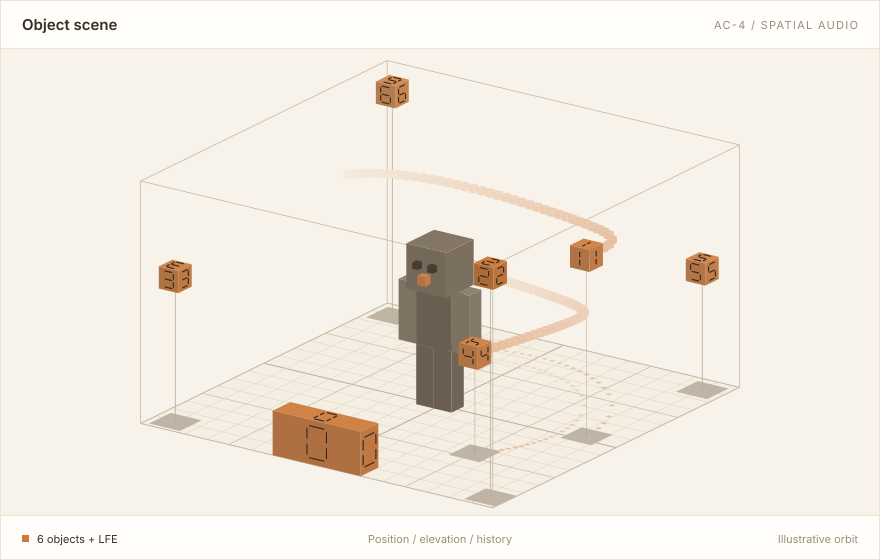

# MacinDecode Spatial Player

[简体中文](README.md) · **English**

A desktop app for **opening, inspecting and playing Dolby AC-4 and APAC spatial audio files**. It brings its
own AC-4 and APAC decoders — no system or third-party media decoder is involved — and sends the decoded audio
objects to system spatial audio or to a software binaural renderer, while drawing those objects live
in a 3D scene in the middle of the window.

The project used to be called **MacinDecode AC-4 Player**; it was renamed once it stopped playing only
AC-4. Your playlists and settings come along on first launch — see
[upgrading from the old name](#upgrading-from-macindecode-ac-4-player).



> This is not a general-purpose music player: it handles AC-4 / APAC `.m4a` and `.mp4`,
> raw `.ac4`, and APAC `.caf`, and does not play MP3, AAC or FLAC.

This page covers installing, getting started and building. **For what everything in the window is
telling you and what each setting does, see the [user manual](docs/MANUAL.en.md)**
([简体中文](docs/MANUAL.md)).

## Contents

- [What you can do with it](#what-you-can-do-with-it)
- [Getting the app](#getting-the-app)
- [Five steps to your first playback](#five-steps-to-your-first-playback)
- [Choosing a playback mode](#choosing-a-playback-mode)
- [Platform support](#platform-support)
- [What Windows spatial audio needs](#what-windows-spatial-audio-needs)
- [FAQ](#faq)
- [Known limits](#known-limits)
- [Building from source](#building-from-source)
- [Decoding and rendering components](#decoding-and-rendering-components)
- [Documentation](#documentation)
- [License](#license)

Default builds include embedded PoseBridge BLE/USB head tracking and device controls; see the [manual](docs/MANUAL.en.md#posebridge-sensors).

## What you can do with it

- **Play immersive AC-4 and APAC multichannel.** Windows uses spatial-audio object passthrough, macOS uses system spatial
  audio, and both platforms can switch to software binaural rendering over ordinary headphones.
- **See what is inside a file.** Container, presentation, object count, LFE channel, bit rate and
  more — no playback required.
- **Keep several playlists.** Create, rename, reorder, drag, copy or move items between lists. Close
  the app and it comes back to the same track and position, paused.
- **Watch the scene in 3D.** Every audio object moves in space as playback advances, from any angle
  you like. One dBFS / LUFS-M button controls the scene and meter readings for all objects and LFE channel 0.
- **Diagnose problems.** A diagnostics window shows buffering, decode and output state, so you can
  tell a file problem from a device problem.
- **Play the built-in demo.** Press **Demo**, top right, and something is playing without a file of
  any kind — immersive AC-4 material is hard to come by. It loops by default, supports pause and
  playing once, and restores your file's saved position paused when stopped. It is synthesised in
  real time and never passes through the decoder, so it exercises the output path but says nothing
  about decoding; see [the manual](docs/MANUAL.en.md#the-built-in-demo).

Supported files: AC-4 / APAC `.m4a` and `.mp4`, raw `.ac4`, and APAC `.caf`. AC-4 focuses on **Full A-JOC**.
APAC supports mono, stereo, 5.1, 7.1, 7.1.4, 9.1.6 and 22.2 with frame-exact seeking; HOA playback is not yet supported.
With macOS **System spatial audio → SAF VBAP → 22.2**, equal-power copy duplicates only a lone audible LFE; two audible LFEs pass through separately at their original levels.
See [APAC multichannel playback](docs/MANUAL.en.md#apac-multichannel-playback).

Choose SAF VBAP or Triple Balance under **Speakers → Speaker renderer** in system spatial mode. Triple Balance supports 7.1.4, 9.1.6 and 22.2; see the [input and LFE limits](docs/MANUAL.en.md#speaker-renderer).

## Getting the app

Check [GitHub Releases](https://github.com/SakuzyPeng/MacinDecode-Spatial-Player/releases) for downloadable
versions and their usage notes. Under **Assets** at the bottom of a version's page, choose an installer
for your computer:

| Your computer | Installer |
| --- | --- |
| Windows 11, 64-bit Intel / AMD PC (keep Windows up to date) | `.msi` |
| macOS 14 or later, Apple silicon Mac (M1 or newer) | `.pkg` |

Double-click the installer and follow its steps. On Windows, the app installs to
`%LOCALAPPDATA%\Programs\MacinDecode Spatial Player`. On Mac, find it in **Applications** inside your
home folder (`~/Applications`). Neither installer requires administrator rights.

On Windows, run the new MSI to update without uninstalling first; a different build of the same
version can also replace the installed build. Reopening the same MSI offers repair and uninstall.
Updates preserve playlists, settings, and imported SOFA files.

### Upgrading from MacinDecode AC-4 Player

- **Your data:** on first launch, if the new app has no data directory yet, it **copies** the old one
  over whole — playlists, resume positions, settings, SOFA files, headphone profiles and skins. The old
  directory is left untouched as a backup, with a `MOVED.txt` saying where the copy went; delete it
  yourself once you are happy with the new app. The old app has to be closed first; if it is still
  running, the new one asks you to quit it.
- **Windows:** just run the new MSI. It replaces the old install — install folder and Start menu
  shortcut take the new name — with no uninstall needed.
- **macOS:** the new app installs as `~/Applications/MacinDecode Spatial Player.app`. The old
  `MacinDecode AC-4 Player.app` is not removed for you; move it to the Bin. Because the app identifier
  changed, macOS asks again for Bluetooth and motion permissions.

Preview installers are not formally signed, so your system may say it cannot verify the developer.
Make sure you downloaded them from this repository's release page. You only need the `.msi` or `.pkg`;
the checksum and build information attachments do not need to be installed. You can also
[build from source](#building-from-source).

## Five steps to your first playback

1. Launch the app. No AC-4 or APAC file to hand? Press **Demo** in the top right and there is immediately
   something to look at and listen to.
2. Click **Add files** in the sidebar, or drag files onto the window.
3. Pick a playlist at the top of the sidebar (`+` creates one, `⋯` manages them). **Single-click** an
   item to inspect it; **double-click** (or press Enter, or right-click → Play) to start playback.
4. Choose a playback mode under **Audio settings**, top right, and an output device in the dropdown
   next to it.
5. The transport at the bottom has previous / play / next, the timeline, volume, mute, and the
   sequential, repeat-one, repeat-all and shuffle modes.

**The 3D scene** (center of the window): drag to orbit, `Shift` + drag to pan, scroll to zoom. The
`ISO` / `TOP` / `BACK` / `SIDE` / `RESET` buttons jump to fixed viewpoints, with a separate
perspective/orthographic projection toggle. The scene draws at most 22 objects at once and says at
the bottom left how many it left out.

**Visual settings**, next to **Audio settings**, decides how the scene is drawn: element numbers
(IDs), object loudness (LVL), fading persistently silent objects, and the meter bank strip to the
right of the scene. The first three are on by default and the bank is off; all four are independent
and remembered across restarts. What each one reads — the two rings on the floor, the nameplate above
a cube, the four marks on a meter row — is in the
[manual](docs/MANUAL.en.md#visual-settings).

**For more detail:** **Details…** on the file card opens the bitstream details window, and the
**`...`** button next to the scene heading opens diagnostics.

## Choosing a playback mode

Switch under **Audio settings**. Picking the wrong one costs nothing — mode changes are applied
live and do not interrupt decoding of the current track.


| Mode | Available on | What it does |
| --- | --- | --- |
| **Automatic** (default) | all | Object passthrough on Windows, system spatial audio on macOS |
| **Windows object passthrough** | Windows | Hands AC-4's dynamic objects (for APAC, its fixed-position channels) straight to Windows Spatial Audio; a spatial sound format must be enabled in Windows first |
| **System spatial audio** | macOS / Windows | Renders a 7.1.4 / 9.1.6 / 22.2 speaker bed and hands it to the system spatializer. 7.1.4 and SAF VBAP (Apple geometry) by default; Triple Balance is the alternative |
| **SAF binaural** | macOS / Windows | Software binaural rendering over any ordinary stereo headphones; built-in KEMAR, or your own SOFA file |

**Not sure which to pick?** To check that a file plays at all, switch to **SAF binaural**: it only
needs ordinary headphones, and depends on neither a system setting nor how many object slots a device
can offer. Windows object passthrough does have hard device requirements — see
[the next section](#what-windows-spatial-audio-needs).

Bed layouts and 22.2's LFE handling, the macOS Control Center Dolby Atmos label, custom HRTFs (SOFA),
headphone compensation (HpTF) with its Bass and Tilt knobs and band-for-band check, per-object head
tracking and listener orientation are all in the
[manual](docs/MANUAL.en.md#playback-modes).

## Platform support

| | Windows 11 (x64, recommended) | macOS 14+ (Apple Silicon) | Linux |
| --- | --- | --- | --- |
| Inspect files | ✅ | ✅ | ✅ |
| Decode | ✅ | ✅ | ✅ |
| Playback | passthrough / system spatial / binaural | system spatial / binaural | ❌ |
| 3D scene | ✅ | ✅ | ✅ (silent preview on the real timeline) |
| Head tracking | PoseBridge BLE/USB or manual | PoseBridge BLE/USB, AirPods (in a proper `.app`) or manual | — |

Keep Windows 11 up to date for fuller spatial audio support. Windows 10's spatial audio limits are
described in the next section.

Decoding works on all three platforms; audio output does not exist outside Windows and macOS, so
Linux gives you a silent build you can inspect, decode and watch. Installers cover Windows x64 and
Apple Silicon only; an Intel Mac can build from source, but that is unverified. The app draws the
scene on the GPU (DX12 on Windows), so it needs a working graphics driver.

## What Windows spatial audio needs

How many objects passthrough can carry depends on how many **dynamic audio objects** the active
Windows spatial sound format offers:

- **AC-4 L3** uses up to 16 objects: the Dolby Atmos headphone or built-in speaker paths on
  Windows 10 are enough.
- **AC-4 L4** needs 20 objects: on those paths that requires an updated Windows 11 — earlier
  versions provide only 16. The Dolby Atmos home theater (HDMI) path offers 20 on earlier versions
  too.
- **APAC** takes one object per main channel: 11 for 7.1.4, 15 for 9.1.6, 22 for 22.2; the LFE
  takes no dynamic slot. Short of slots, use the fixed speaker bed of **System spatial audio** instead.
- Dolby Atmos requires **Dolby Access** to be installed and the matching spatial sound format enabled
  in Windows. The Windows Spatial Audio API itself does not mandate Dolby Atmos.

Microsoft documents the object limits under
[Spatial Sound runtime resource limits](https://github.com/MicrosoftDocs/win32/blob/docs/desktop-src/CoreAudio/spatial-sound.md#microsoft-spatial-sound-runtime-resource-implications).
A device greyed out in the output dropdown is one without enough slots; hover it to see how many it
is short of.

## FAQ

**Why is there no sound?**
Check the status line and the diagnostics window first. A decode failure means this file's AC-4
flavor or APAC layout (HOA, for instance) is not supported yet; an unavailable output usually means the playback mode does not match
the device. Windows object passthrough needs a device with enough dynamic-object slots (see above).
To check the file itself first, switch to **SAF binaural** — it only needs ordinary headphones.

**Why is the timeline greyed out?**
A seek index is built in the background as soon as a file is opened, and dragging is disabled until
it lands — playback itself never waits for it, and the status line says indexing is in progress. A
few files have no safe seek points at all, in which case the timeline stays disabled.

**Why did dragging the timeline do nothing?**
Dragging only previews; the seek happens when you release, and your play/pause state is preserved.
If there is no safe seek point before the target, the app refuses that seek and leaves the current
playback alone.

**Sound direction lags when I turn my head.**
Rule out playback-chain latency first. Virtual sound cards, virtual mixers and wireless headphones
all add buffering. Compare against a wired headset plugged straight into the sound card, then add
the other devices back one at a time — that separates chain latency from head-tracking response.

**Where are my playlists and settings stored?**

- macOS: `~/Library/Application Support/com.macinrender.macindecode-spatial-player/`
- Windows: `%APPDATA%\com.macinrender.macindecode-spatial-player\data\`
- Linux: `${XDG_DATA_HOME:-~/.local/share}/com.macinrender.macindecode-spatial-player/`

That folder holds the playlist database (`library.sqlite3`), settings (`settings.json`), window state
(`app.ron`), SOFA files (`sofa/`), headphone compensation profiles (`hptf/`) and imported
skins (`skins/`). Deleting it resets the app. Starting with
`--data-dir <path>` uses a separate data directory instead. Upgrading from MacinDecode AC-4 Player
copies its directory (the one named `macindecode-ac4-player`) here; see
[upgrading from the old name](#upgrading-from-macindecode-ac-4-player).

**A file was renamed or moved — now what?**
Right-click the item → **Locate file…** and point it at the new path; every playlist referring to
that file is updated together. Unreadable items are never removed automatically, and you can retry
them at any time.

**What if a file changes while it is playing?**
If the file's size or modification time changes during playback, playback stops safely; remove the
item and add it again to continue. Renaming or deleting a file mid-playback does not affect the
current track — the app keeps using the file handle it already opened.

## Known limits

- **No automatic loudness processing:** no loudness normalization, dynamic range control, dialogue
  enhancement or extra downmixing.
- The current focus is **Full A-JOC**; other AC-4 coding flavors may not play.
- **APAC HOA does not play yet**, though it can be inspected.
- **Triple Balance** needs 48 kHz input when an LFE is present or the output is 22.2, and does not
  accept dual-LFE 22.2 input — use SAF VBAP for those files.
- **Seeking has prerequisites:** MP4/M4A needs a container sync sample *and* Full random access as
  reported by the decoder; raw `.ac4` needs sync-frame ranges plus Full random access.
- A raw `.ac4` stream that changes sample rate mid-file stops safely with an error rather than
  guessing a timeline across rates.
- MP4 `moov` metadata is capped at 64 MiB and a single packet at roughly 16 MiB; going over is a
  clear error rather than an allocation.
- The 3D scene draws at most 22 objects at a time.
- The spatial result ultimately depends on the content, the OS settings and the output device.
  Software binaural works with any ordinary stereo device.

## Building from source

### What you need

- **Rust 1.98** — pinned in `rust-toolchain.toml`, so rustup installs it for you.
- **Python 3.11+** — to prepare build inputs (the Windows MSI inspection needs 3.12).
- **CMake, Ninja and a C++20 toolchain** — macOS/Windows only, to build the MacinRender native
  renderer. Not needed on Linux.
- **Network access** — the build script downloads a checksum-pinned Noto Sans CJK font so CJK file
  names render. Point `MACINDECODE_UI_FONT_PATH` at a local font file to skip the download.

### Three build sizes

| Build | Command | Spec tables | C++ toolchain |
| --- | --- | --- | --- |
| Inspection only | `cargo run --no-default-features` | ❌ | ❌ |
| Decode + scene preview + Windows passthrough | `cargo run --no-default-features --features decode` | ✅ | ❌ |
| Everything (default) | `cargo run` | ✅ | ✅ (macOS/Windows) |

"Spec tables" are three files generated locally from the official ETSI TS 103 190 specification.
**Every platform needs them** — it is a build input, not a platform limitation — and this repository
neither commits nor distributes them.

### Prepare the build inputs (once)

```sh
python scripts/prepare_inputs.py
```

This checks out [MacinDecode-AC4-Core](https://github.com/SakuzyPeng/MacinDecode-AC4-Core) and
[MacinRender-ADM-Core](https://github.com/SakuzyPeng/MacinRender-ADM-Core) at the commits pinned in
`Cargo.toml` and `crates/macinrender/native/CMakeLists.txt` and generates the spec tables under the
gitignored `.ci-inputs/`. MacinRender's numerical kernels are Rust, compiled and linked by Cargo along
with the player, so OpenBLAS and Boost are no longer needed. The APAC decoder,
[MacinDecode-APAC-Core](https://github.com/SakuzyPeng/MacinDecode-APAC-Core), is an ordinary Cargo
dependency and needs no extra input. Then point your shell at the inputs:

```bash
export MACINDECODE_AC4_SPEC_DIR="$PWD/.ci-inputs/ac4-core/spec"
export MACINRENDER_SOURCE_DIR="$PWD/.ci-inputs/macinrender"
```

```bat
set "MACINDECODE_AC4_SPEC_DIR=%CD%\.ci-inputs\ac4-core\spec"
set "MACINRENDER_SOURCE_DIR=%CD%\.ci-inputs\macinrender"
```

`MACINDECODE_AC4_SPEC_DIR` must contain `generated/ts103190_pdf_tables.rs`, `ts_103190_tables.c` and
`ts_103190_tables_part2.c`. A full build uses CMake/Ninja, a C++20 compiler and Rust 1.98.
The packaging script below prepares the inputs and builds in the same process.

### Everyday commands

```bash
cargo run
cargo test
cargo fmt --all -- --check
cargo clippy --all-targets -- -D warnings
```

A plain `cargo test` needs no audio device and no real media. The hardware and media regressions are
ignored by default; set `MACINDECODE_AC4_TEST_MEDIA` and run them explicitly:

```sh
cargo test decoder::worker::tests::decodes_local_media_into_a_bounded_scene_buffer -- --ignored
cargo test decoder::worker::tests::seeks_real_media_across_epochs_on_the_open_file -- --ignored
cargo test backend::windows::tests::submits_decoded_scene_to_windows_spatial_audio -- --ignored
cargo test -p macindecode-windows-spatial-audio ended_renderer_releases_objects_without_entering_failed_state -- --ignored
```

Real media belongs only in the gitignored `.local-test-media/` at the repository root, never in Git.

### Packaging

```sh
python scripts/package.py --target x86_64-pc-windows-msvc
python3 scripts/package.py --target aarch64-apple-darwin
```

The script prepares the pinned build inputs itself, builds release, and checks the actual payload,
its system dependencies, native rendering and a real graphics window before writing the installer,
its checksum and a build manifest to `dist/`. Pull requests, pushes to `main` and manual runs go
through the same pipeline on both platforms — see [packaging and CI](docs/PACKAGING.md)
(in Chinese).

## Documentation

The complete interface reference for users is the
[user manual](docs/MANUAL.en.md) ([简体中文](docs/MANUAL.md)).

The design docs, which describe how the code is organised, are written in Chinese:
[architecture](docs/ARCHITECTURE.md) ·
[playback integration (MacinRender)](docs/MACINRENDER.md) ·
[Windows decode](docs/WINDOWS_DECODE.md) ·
[Windows Spatial Audio](docs/WINDOWS_SPATIAL_AUDIO.md) ·
[playlists and persistence](docs/PLAYLISTS.md) ·
[data directory and SOFA](docs/STORAGE.md) ·
[packaging and CI](docs/PACKAGING.md)

## Decoding and rendering components

The player holds no decoding or rendering algorithms of its own. They come from four separate
repositories, each pinned in `Cargo.toml` and `crates/macinrender/native/CMakeLists.txt`:

| Component | What it does |
| --- | --- |
| [MacinDecode-AC4-Core](https://github.com/SakuzyPeng/MacinDecode-AC4-Core) | AC-4 bitstream inspection and decoding, the MP4 container |
| [MacinDecode-APAC-Core](https://github.com/SakuzyPeng/MacinDecode-APAC-Core) | APAC decoding, CAF / MP4 containers, frame-exact seeking |
| [MacinRender-ADM-Core](https://github.com/SakuzyPeng/MacinRender-ADM-Core) | SAF VBAP, Triple Balance, SAF HRTF binaural rendering and device output |
| [PoseBridge](https://github.com/SakuzyPeng/PoseBridge) | BLE/USB head-tracking sensors |

### Bit-identical rendering across platforms

When MacinRender's numerical code moved to Rust, the sources that made results depend on the machine
were removed one by one: the FFT always takes the scalar path instead of picking AVX or NEON by CPU,
resampling uses a patched scalar implementation with its own sin/cos, and the OM spreader uses a
pure-Rust libm with a fixed group count. At the pinned commit, Core's consistency CI gates 150 PCM
cases as **bit-identical** on macOS arm64, Linux x64 and Windows x64. They cover binaural, VBAP,
Triple Balance in all three layouts, device-side DSP (volume, headphone compensation, peak
protection), and resampling between 44.1, 48 and 96 kHz.

For the player, with the same input, settings and device block size, the software binaural feed and
the speaker bed come out as the same bits **before** they reach the device, whether you are on a Mac
or a PC. It does not mean two machines record identical playback:

- how many frames a device asks for at a time, and when head-tracking poses arrive, differ by machine;
- everything after the hand-off to system spatial audio, and Windows object passthrough, is rendered
  by the operating system;
- external SOFA files and AC-4 / APAC decoding are outside this matrix.

`scripts/test_render_determinism.py` keeps the conditions the player has to preserve when it links
this code. Scope and evidence are in Core's [phase-two closeout](https://github.com/SakuzyPeng/MacinRender-ADM-Core/blob/d75d46028b85a84394ffaad32726e68c89549ae3/docs/architecture/RUST_PHASE2_CLOSEOUT.md) (in Chinese).

## License

Released under the [MIT License](LICENSE). The app's About page embeds the license notices of every
third-party dependency.

The built-in demo is Pachelbel's Canon in D (*Canon per 3 Violini e Basso*, 1694), a public-domain
composition synthesised in real time by this application — **no recording is included**. The notes
were transcribed from the LilyPond typesetting published by the Mutopia Project as
`Mutopia-2015/09/02-2047`, maintained by Michael Fischer v. Mollard, which is licensed under
[CC BY 4.0](https://creativecommons.org/licenses/by/4.0/). The same attribution appears on the
app's About page.
