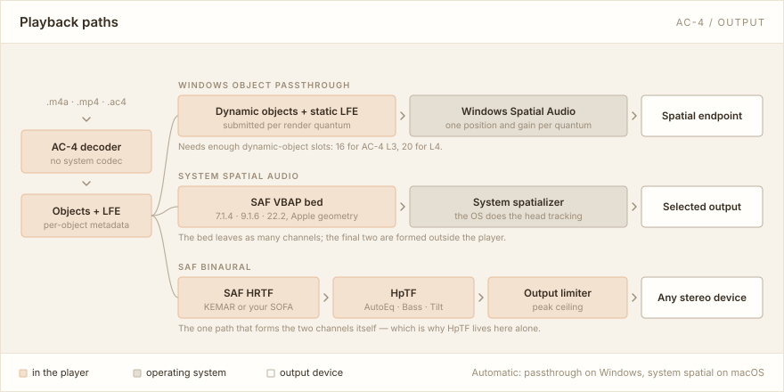

# MacinDecode Spatial Player

**简体中文** · [English](README.en.md)

一个用来**打开、查看和播放 Dolby AC-4 与 APAC 空间音频文件**的桌面应用。它自带 AC-4 和 APAC 解码器，
不调用系统或第三方媒体解码器；解码出的音频对象既可以送到系统空间音频或耳机双耳渲染，
也会实时画在窗口中央的三维场景里。

本项目原名 **MacinDecode AC-4 Player**；支持 APAC 之后不再只播 AC-4，因此改名。旧版的播放列表和设置会在
第一次启动时自动带过来，见[从旧版升级](#从-macindecode-ac-4-player-升级)。


> 它不是通用音乐播放器：处理 AC-4 / APAC 的 `.m4a`、`.mp4`，裸 `.ac4` 以及 APAC `.caf`，不播放 MP3、AAC、FLAC。

本文只讲安装、上手和构建。**窗口里每样东西读的是什么、每个设置项做什么，见[用户手册](docs/MANUAL.md)**（[English](docs/MANUAL.en.md)）。

## 目录

- [能用它做什么](#能用它做什么)
- [获取应用](#获取应用)
- [上手五步](#上手五步)
- [播放模式怎么选](#播放模式怎么选)
- [平台支持](#平台支持)
- [Windows 空间音频的前提](#windows-空间音频的前提)
- [常见问题](#常见问题)
- [已知限制](#已知限制)
- [从源码构建](#从源码构建)
- [解码与渲染组件](#解码与渲染组件)
- [文档](#文档)
- [许可证](#许可证)

默认构建包含内置 PoseBridge BLE／USB 头追和设备管理，详见[操作手册](docs/MANUAL.md#posebridge-传感器)。

## 能用它做什么

- **播放 AC-4 沉浸声和 APAC 多声道**：Windows 走空间音频对象直通，macOS 走系统空间音频，两个平台都可以改用软件双耳（普通耳机即可）。
- **看清文件里有什么**：容器、节目、对象数量、低频声道、码率等信息，不播放也能看。
- **管理多个播放列表**：新建、改名、排序、拖拽、跨列表复制或移动；关掉再打开会回到上次那首歌和断点，并保持暂停。
- **实时三维场景**：每个音频对象在空间中的位置随播放推进移动，可以任意角度观察。
  动态对象和 0 号 LFE 的表带与三维读数统一跟随 dBFS / LUFS-M 单位按钮。
- **出问题时能查**：诊断窗口显示缓冲、解码和输出状态，帮你判断是文件的问题还是设备的问题。
- **自带一段演示曲目**：右上角 **Demo** 即可播放，不需要任何文件——AC-4 沉浸声素材本来就不好找。
  默认循环，可暂停或选择只播一次；停止后恢复原文件的断点并保持暂停。
  它是实时合成的，不经过解码器，所以能验证输出链路但验证不了解码；详见
  [用户手册](docs/MANUAL.md#内置演示曲目)。

支持 AC-4 / APAC `.m4a`、`.mp4`、裸 `.ac4` 和 APAC `.caf`。AC-4 主要面向 **Full A-JOC**。
APAC 支持单声道、立体声、5.1、7.1、7.1.4、9.1.6、22.2，以及按帧精确跳转；HOA 暂不播放。
22.2 保留两路独立 LFE。在 macOS 的 **系统空间音频 → SAF VBAP → 22.2** 下，等功率复制仅在一路有信号时生效，两路都有信号时各自原电平直通；详见[操作手册](docs/MANUAL.md#apac-多声道)。

系统空间音频可在 **Speakers → Speaker renderer** 选择 SAF VBAP 或 Triple Balance；后者支持 7.1.4、9.1.6、22.2，LFE 与输入范围见[扬声器渲染算法](docs/MANUAL.md#扬声器渲染算法)。

## 获取应用

请到 [GitHub Releases](https://github.com/SakuzyPeng/MacinDecode-Spatial-Player/releases) 查看可下载的版本和使用说明。
在对应版本页面下方的 **Assets** 中，按电脑选择安装包：

| 你的电脑 | 安装包 |
| --- | --- |
| Windows 11，Intel / AMD 64 位电脑（建议保持系统更新） | `.msi` |
| macOS 14 或更新版本，Apple 芯片 Mac（M1 及更新机型） | `.pkg` |

双击安装包，按提示完成安装。Windows 装到 `%LOCALAPPDATA%\Programs\MacinDecode Spatial Player`，
Mac 上的应用位于个人文件夹中的 **Applications（应用程序）**，即 `~/Applications`；都不需要管理员权限。

Windows 更新时直接运行新的 MSI 即可，无需先卸载；相同版本的不同构建也能覆盖安装。
再次打开同一份 MSI 可以修复或卸载。升级会保留播放列表、设置和已导入的 SOFA 文件。

### 从 MacinDecode AC-4 Player 升级

- **数据**：新版第一次启动时，如果还没有自己的数据目录，就把旧版的数据目录**整个复制**过来——播放列表、
  续播断点、设置、SOFA、耳机补偿曲线和皮肤都在。旧目录原样保留作备份，里面会多一份 `MOVED.txt` 说明去向；
  确认新版一切正常后可以自行删除。复制前旧版必须已经退出，否则新版会提示先关掉它。
- **Windows**：直接运行新的 MSI，会替换掉旧版（安装目录、开始菜单快捷方式一起换成新名字），不必先卸载。
- **macOS**：新版装成 `~/Applications/MacinDecode Spatial Player.app`，旧的 `MacinDecode AC-4 Player.app`
  不会被自动删除，手动移到废纸篓即可。新应用的标识不同，系统会重新询问蓝牙、运动传感器等权限。

预览版安装包尚未正式签名，系统可能提示无法验证开发者。请确认下载来源是本仓库的发布页面。
普通使用只需下载 `.msi` 或 `.pkg`，其余校验和、构建信息附件无需安装。也可以按
[从源码构建](#从源码构建) 自行编译。

## 上手五步

1. 启动应用。手边没有 AC-4 / APAC 文件？先点右上角的 **Demo**，立刻就有东西可看可听。
2. 点击侧栏的 **Add files**，或者直接把文件拖进窗口。
3. 侧栏顶部选择播放列表（`+` 新建，`⋯` 管理）。**单击**条目查看信息，**双击**（或按 Enter、右键 → Play）开始播放。
4. 右上角 **Audio settings** 选择播放模式，旁边的下拉框选择输出设备。
5. 底部是播放控制：上一曲 / 播放 / 下一曲、进度条、音量、静音，以及顺序、单曲循环、列表循环和随机。

**三维场景**（窗口中央）：拖动旋转视角，`Shift` + 拖动平移，滚轮缩放；右上角 `ISO` / `TOP` / `BACK` /
`SIDE` / `RESET` 可以直接跳到固定视角，另有按钮切换透视/正交投影。场景一次最多画 22 个对象，超出时左下角
会说明还有多少没画出来。

**Audio settings** 旁的 **Visual settings** 控制场景怎么画：元素编号（IDs）、响度显示（LVL）、持续静音
对象淡出，以及场景右侧的表带（Meter bank）。前三个默认开启，表带默认关闭；四个开关相互独立，并在重启后保留。
它们各自读的是什么——地面那两层光圈、方块上方的铭牌、表带一行上的四个标记——见
[用户手册 → Visual settings](docs/MANUAL.md#visual-settings)。

**想看更多细节**：文件卡片上的 **Details…** 打开比特流详情窗口，场景标题右侧的 **`...`** 打开诊断窗口。

## 播放模式怎么选

在 **Audio settings** 里切换。选错了也不要紧——切换是热生效的，不会中断当前这首歌的解码。



| 模式 | 可用平台 | 说明 |
| --- | --- | --- |
| **Automatic**（默认） | 全部 | Windows 用对象直通，macOS 用系统空间音频 |
| **Windows object passthrough** | Windows | 把 AC-4 的动态对象（APAC 则是各个固定位置的声道）原样交给 Windows 空间声音，需要先在系统里启用空间声音格式 |
| **System spatial audio** | macOS / Windows | 先渲染成 7.1.4 / 9.1.6 / 22.2 多声道床，再交给系统的空间音频。默认 7.1.4、SAF VBAP（Apple 几何），可改用 Triple Balance |
| **SAF binaural** | macOS / Windows | 软件双耳渲染，任何普通立体声耳机都能用；内置 KEMAR，也可以选自己的 SOFA 文件 |

**不确定选哪个？** 想先确认文件本身能播，切到 **SAF binaural**——它只需要一副普通耳机，不依赖系统设置，
也不依赖设备能提供多少对象槽位。Windows 对象直通对设备有硬性要求，见[下一节](#windows-空间音频的前提)。

床布局、扬声器渲染算法与 22.2 的 LFE 处理、macOS 控制中心的杜比全景声标签、自定义 HRTF（SOFA）、耳机补偿（HpTF）的
Bass / Tilt 与逐段核对、逐对象头追与听者朝向，都在
[用户手册 → 播放模式](docs/MANUAL.md#播放模式)。

## 平台支持

| | Windows 11（x64，推荐） | macOS 14+（Apple Silicon） | Linux |
| --- | --- | --- | --- |
| 查看文件信息 | ✅ | ✅ | ✅ |
| 解码 | ✅ | ✅ | ✅ |
| 播放 | 对象直通 / 系统空间音频 / 软件双耳 | 系统空间音频 / 软件双耳 | ❌ |
| 三维场景 | ✅ | ✅ | ✅（按真实时间轴推进的静音预览） |
| 头部追踪 | PoseBridge BLE/USB 或手动 | PoseBridge BLE/USB、AirPods（正式 `.app`）或手动 | — |

建议保持 Windows 11 更新，以获得更完整的空间音频支持。Windows 10 的空间音频限制见下一节。

解码在三个平台上都可用；Windows 与 macOS 之外没有播放输出，Linux 上得到的是可以看、可以检查、
可以看场景推进的静音预览。安装包只覆盖 Windows x64 与 Apple Silicon；Intel Mac 可以从源码构建，但未经验证。
应用使用 GPU 绘制场景（Windows 走 DX12），需要可用的显卡驱动。

## Windows 空间音频的前提

对象直通能播多少对象，取决于当前 Windows 空间声音格式能提供的**动态对象数量**：

- **AC-4 L3** 最多 16 个对象：Windows 10 的 Dolby Atmos 耳机或内置扬声器路径即可回放。
- **AC-4 L4** 需要 20 个对象：上述路径需要更新后的 Windows 11，较早版本只提供 16 个；
  Dolby Atmos 家庭影院（HDMI）路径在较早版本上也能提供 20 个。
- **APAC** 的每个主声道占一个对象：7.1.4 要 11 个、9.1.6 要 15 个、22.2 要 22 个，LFE 不占动态对象。
  槽位不够时改用 **System spatial audio** 的固定扬声器床。
- 使用 Dolby Atmos 需要安装 **Dolby Access** 并在 Windows 设置里启用对应的空间声音格式。
  Windows Spatial Audio API 本身并不强制使用 Dolby Atmos。

对象数量限制见 Microsoft 的
[Spatial Sound runtime resource limits](https://github.com/MicrosoftDocs/win32/blob/docs/desktop-src/CoreAudio/spatial-sound.md#microsoft-spatial-sound-runtime-resource-implications)。
输出设备下拉框里灰掉的设备就是槽位不够的设备，把鼠标停在上面会说明还差多少。

## 常见问题

**为什么没有声音？**
先看状态栏和诊断窗口：如果显示解码失败，说明这个文件的 AC-4 形式或 APAC 布局（例如 HOA）暂不支持；如果显示输出不可用，
多半是播放模式与设备不匹配。Windows 对象直通要求设备提供足够的动态对象槽位（见上一节）；
想先确认文件本身能播，可以切到 **SAF binaural**，它只需要一副普通耳机。

**进度条为什么是灰的？**
打开文件后，后台会并行建立跳转索引，索引完成之前不能拖动——这不影响播放，第一次播放不用等它。
状态栏会显示正在建立索引。少数文件本身没有安全的跳转点，那么进度条会一直不可用。

**拖动进度条为什么没反应？**
拖动过程只是预览，松手才真正跳转，并保持你原来的播放/暂停状态。如果目标位置之前没有安全跳转点，
应用会拒绝这次跳转，当前播放不受影响。

**转头之后声音方向跟不上？**
先排除回放链路的延迟。虚拟声卡、虚拟混音软件和无线耳机都会引入额外缓冲。建议先用声卡直连有线耳机
作为对照，再逐一接入其他设备，就能区分是链路延迟还是头部追踪本身的响应。

**播放列表和设置存在哪里？**

- macOS：`~/Library/Application Support/com.macinrender.macindecode-spatial-player/`
- Windows：`%APPDATA%\com.macinrender.macindecode-spatial-player\data\`
- Linux：`${XDG_DATA_HOME:-~/.local/share}/com.macinrender.macindecode-spatial-player/`

里面是播放列表数据库（`library.sqlite3`）、设置（`settings.json`）、窗口状态（`app.ron`）、SOFA 文件（`sofa/`）、耳机补偿曲线（`hptf/`）和已导入皮肤（`skins/`）。
删掉整个目录就能恢复初始状态。加 `--data-dir <路径>` 启动可以使用独立的数据目录。
从 MacinDecode AC-4 Player 升级时，旧目录（名字里是 `macindecode-ac4-player`）会被复制到这里，见[从旧版升级](#从-macindecode-ac-4-player-升级)。

**文件改名或移动之后怎么办？**
右键条目 → **Locate file…** 重新指向新位置，该文件在所有播放列表里的引用都会一起更新。
无法读取的条目不会被自动删除，可以随时重试。

**播放中改动了文件会怎样？**
播放期间检测到文件大小或修改时间变化会安全停止；把条目移除再重新添加即可继续。
播放过程中改名或删除文件不影响当前这首——应用使用已经打开的文件句柄。

## 已知限制

- **不做任何自动响度处理**：不应用响度调整、动态范围控制（DRC）、对白增强或额外降混。
- 当前聚焦 **Full A-JOC** 内容，其他 AC-4 编码形式可能无法播放。
- **APAC 的 HOA 暂不播放**，但可以查看信息。
- **Triple Balance** 带 LFE 或输出 22.2 时要求 48 kHz 输入，并且不接受双 LFE 的 22.2 输入——那种文件请用 SAF VBAP。
- **跳转有前提**：MP4/M4A 需要容器同步样本加上解码器报告的 Full random access；裸 `.ac4` 需要同步帧范围
  加上 Full random access。
- 裸 `.ac4` 在中途改变采样率会安全停止并报错，不跨采样率推测时间线。
- MP4 `moov` 元数据上限 64 MiB，单个 packet 上限约 16 MiB，超出会明确报错。
- 三维场景一次最多绘制 22 个对象。
- 空间效果最终取决于文件内容、系统设置和输出设备能力；软件双耳则支持任何普通立体声设备。

## 从源码构建

### 需要准备

- **Rust 1.98**——`rust-toolchain.toml` 已锁定版本，rustup 会自动安装。
- **Python 3.11+**——用于准备构建输入（Windows 上的 MSI 检查需要 3.12）。
- **CMake、Ninja 和 C++20 工具链**——仅 macOS/Windows 需要，用于编译 MacinRender 原生渲染库；Linux 不需要。
- **网络**——构建脚本会下载校验过的 Noto Sans CJK 字体用于显示中日韩文件名；可用
  `MACINDECODE_UI_FONT_PATH` 指定本地字体文件跳过下载。

### 三种构建规模

| 构建 | 命令 | 需要规范表 | 需要 C++ 工具链 |
| --- | --- | --- | --- |
| 只做检查 | `cargo run --no-default-features` | ❌ | ❌ |
| 解码 + 场景预览 + Windows 对象直通 | `cargo run --no-default-features --features decode` | ✅ | ❌ |
| 完整功能（默认） | `cargo run` | ✅ | ✅（macOS/Windows） |

“规范表”指从官方 ETSI TS 103 190 规范在本地生成的三份表格。**所有平台都需要**——这是构建输入，
不是平台限制；本仓库不会提交或分发这些文件。

### 准备构建输入（做一次即可）

```sh
python scripts/prepare_inputs.py
```

它按 `Cargo.toml` 和 `crates/macinrender/native/CMakeLists.txt` 里锁定的提交检出
[MacinDecode-AC4-Core](https://github.com/SakuzyPeng/MacinDecode-AC4-Core) 与
[MacinRender-ADM-Core](https://github.com/SakuzyPeng/MacinRender-ADM-Core)，生成规范表，输入放进被忽略的
`.ci-inputs/`。MacinRender 的数值内核是 Rust，随主程序由 Cargo 一起编译和链接，不再需要 OpenBLAS 或 Boost。
APAC 解码器 [MacinDecode-APAC-Core](https://github.com/SakuzyPeng/MacinDecode-APAC-Core) 是普通的 Cargo 依赖，
不需要额外的输入。
然后在你的 shell 里指向它们：

```bash
export MACINDECODE_AC4_SPEC_DIR="$PWD/.ci-inputs/ac4-core/spec"
export MACINRENDER_SOURCE_DIR="$PWD/.ci-inputs/macinrender"
```

```bat
set "MACINDECODE_AC4_SPEC_DIR=%CD%\.ci-inputs\ac4-core\spec"
set "MACINRENDER_SOURCE_DIR=%CD%\.ci-inputs\macinrender"
```

`MACINDECODE_AC4_SPEC_DIR` 指向的目录里必须有 `generated/ts103190_pdf_tables.rs`、
`ts_103190_tables.c` 和 `ts_103190_tables_part2.c`。完整构建使用 CMake/Ninja、C++20 编译器与 Rust 1.98。
下面的打包脚本会在同一个进程里准备输入再构建。

### 日常命令

```bash
cargo run
cargo test
cargo fmt --all -- --check
cargo clippy --all-targets -- -D warnings
```

普通 `cargo test` 不需要音频设备，也不需要真实媒体。涉及硬件和真实媒体的回归测试是 ignored 的，
需要设置 `MACINDECODE_AC4_TEST_MEDIA` 后单独运行：

```sh
cargo test decoder::worker::tests::decodes_local_media_into_a_bounded_scene_buffer -- --ignored
cargo test decoder::worker::tests::seeks_real_media_across_epochs_on_the_open_file -- --ignored
cargo test backend::windows::tests::submits_decoded_scene_to_windows_spatial_audio -- --ignored
cargo test -p macindecode-windows-spatial-audio ended_renderer_releases_objects_without_entering_failed_state -- --ignored
```

真实媒体只放在仓库根目录被忽略的 `.local-test-media/`，不要提交到 Git。

### 打包

```sh
python scripts/package.py --target x86_64-pc-windows-msvc
python3 scripts/package.py --target aarch64-apple-darwin
```

脚本自己准备锁定的构建输入，构建 release，检查实际载荷、系统依赖、原生渲染和图形窗口，通过后才在
`dist/` 输出安装包、校验和与构建清单。PR、`main` 推送和手动触发都会在两个平台跑同一套流程，
详见 [安装包与 CI](docs/PACKAGING.md)。

## 文档

面向使用者的完整界面说明是[用户手册](docs/MANUAL.md)（[English](docs/MANUAL.en.md)）。

下面是设计文档（中文），讲的是代码怎么组织的：

[架构](docs/ARCHITECTURE.md) ·
[播放集成（MacinRender）](docs/MACINRENDER.md) ·
[Windows 解码](docs/WINDOWS_DECODE.md) ·
[Windows Spatial Audio](docs/WINDOWS_SPATIAL_AUDIO.md) ·
[播放列表与持久化](docs/PLAYLISTS.md) ·
[数据目录与 SOFA](docs/STORAGE.md) ·
[安装包与 CI](docs/PACKAGING.md)

## 解码与渲染组件

播放器本身不含解码或渲染算法，它们来自四个独立仓库，版本都锁定在 `Cargo.toml` 和
`crates/macinrender/native/CMakeLists.txt` 里：

| 组件 | 负责 |
| --- | --- |
| [MacinDecode-AC4-Core](https://github.com/SakuzyPeng/MacinDecode-AC4-Core) | AC-4 比特流检查与解码、MP4 容器 |
| [MacinDecode-APAC-Core](https://github.com/SakuzyPeng/MacinDecode-APAC-Core) | APAC 解码、CAF / MP4 容器与帧精确跳转 |
| [MacinRender-ADM-Core](https://github.com/SakuzyPeng/MacinRender-ADM-Core) | SAF VBAP、Triple Balance、SAF HRTF 双耳渲染与设备输出 |
| [PoseBridge](https://github.com/SakuzyPeng/PoseBridge) | BLE／USB 头追传感器 |

### 渲染的跨平台逐位一致

MacinRender 的数值代码迁到 Rust 时，专门清掉了让结果随机器变化的来源：FFT 固定走标量路径，不再按 CPU
挑 AVX 或 NEON；重采样换成打过补丁的标量实现和自带的 sin/cos；OM spreader 改用纯 Rust 的 libm，
并固定分组数。锁定提交的一致性 CI 里有 150 个 PCM 用例被设为门禁，要求在 macOS arm64、Linux x64 和
Windows x64 上**逐位相同**。这些用例覆盖双耳、VBAP、Triple Balance 的三种布局、设备端 DSP（音量、
耳机补偿、峰值保护），以及 44.1 / 48 / 96 kHz 之间的重采样。

对播放器来说，输入、设置和设备每次取的帧数都相同时，软件双耳和扬声器床在交给设备**之前**算出的是同一串
比特，不管你用的是 Mac 还是 PC。这不等于两台电脑录下来的回放一模一样：

- 设备每次取多少帧、头追姿态何时到达，都因机器而异；
- 交给系统空间音频之后的部分，以及 Windows 对象直通，由操作系统渲染；
- 外部 SOFA 文件和 AC-4 / APAC 解码不在这套矩阵里。

播放器用 `scripts/test_render_determinism.py` 守住链接这份代码时的前提。范围与证据见上游的
[二期结项记录](https://github.com/SakuzyPeng/MacinRender-ADM-Core/blob/d75d46028b85a84394ffaad32726e68c89549ae3/docs/architecture/RUST_PHASE2_CLOSEOUT.md)。

## 许可证

本项目采用 [MIT License](LICENSE)。应用的 About 页面内嵌了全部第三方依赖的许可声明。

内置演示曲目是帕赫贝尔的 D 大调卡农（*Canon per 3 Violini e Basso*，1694），作品已进入公有领域，
由本应用实时合成——**不包含任何录音**。乐谱转写自 Mutopia Project 发布的 LilyPond 制谱
（`Mutopia-2015/09/02-2047`，维护者 Michael Fischer v. Mollard），该制谱采用
[CC BY 4.0](https://creativecommons.org/licenses/by/4.0/) 许可。同一条署名也列在应用的 About 页面里。
