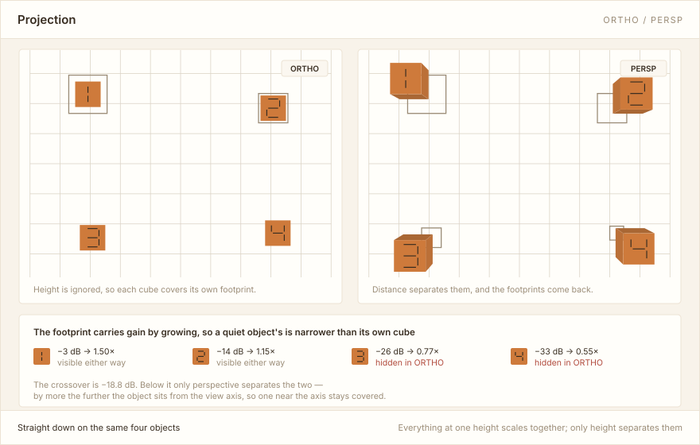
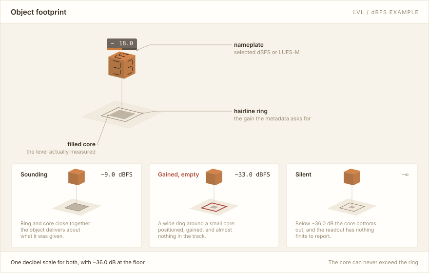
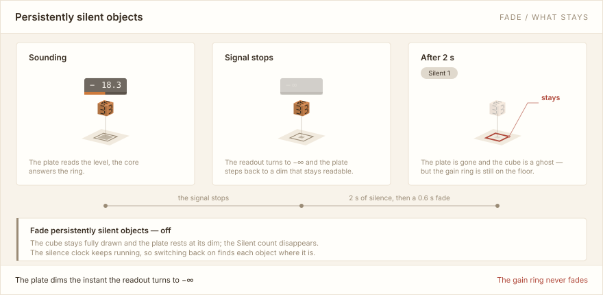
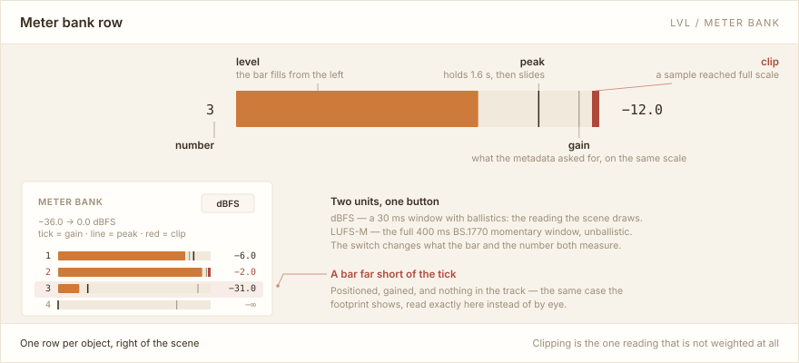

# User manual

[简体中文](MANUAL.md) · **English** · [back to the README](../README.en.md)

The [README](../README.en.md) gets the app installed, opened and making its first sound. This manual
picks up there and covers **what everything in the window is telling you**. It is not a design
document — the [developer docs](#further-reading) are elsewhere and describe how the code is put
together; this one only covers what you can see on screen.

You do not have to read it in order. Jump to what you are looking at: for the cubes and rings in the
scene, see [object loudness](#object-loudness-lvl); for which playback mode to choose and why
headphone compensation appears in only one of them, see [playback modes](#playback-modes).

## Contents

- [The window](#the-window)
- [The built-in demo](#the-built-in-demo)
- [The 3D scene](#the-3d-scene)
- [Visual settings](#visual-settings)
  - [Element numbers (IDs)](#element-numbers-ids)
  - [Object loudness (LVL)](#object-loudness-lvl)
  - [Fading persistently silent objects](#fading-persistently-silent-objects)
  - [The meter bank](#the-meter-bank)
  - [Listener skins](#listener-skins)
- [Playback modes](#playback-modes)
  - [The four modes](#the-four-modes)
  - [Pages in the settings window](#pages-in-the-settings-window)
  - [System spatial audio](#system-spatial-audio)
  - [Software binaural and HRTFs](#software-binaural-and-hrtfs)
  - [Headphone compensation (HpTF)](#headphone-compensation-hptf)
  - [Head tracking and listener orientation](#head-tracking-and-listener-orientation)
- [Looking inside a file](#looking-inside-a-file)
- [Further reading](#further-reading)

## The window

Four regions, all in fixed positions:

- **The sidebar**, left — playlists and files. Pick a list at the top (`+` creates one, `⋯` manages
  them); the items below belong to it. **Single-click** an item to inspect it, **double-click** (or
  press Enter, or right-click → Play) to start playback.
- **The centre** — the 3D scene, where every object's position is drawn live.
- **The top right** — **Demo** plays the built-in demo track (see [below](#the-built-in-demo)),
  **About** shows the version and the third-party licences, and two settings buttons follow.
  **Audio settings** decides how sound leaves the app, **Visual settings** decides how the scene is
  drawn. Those two are independent, and changing either one never interrupts decoding of the
  current track.
- **The bottom** — the transport: previous / play / next, the timeline, volume, mute, and the
  sequential, repeat-one, repeat-all and shuffle modes.

Opening the **meter bank** takes a strip from the right of the scene; see
[the meter bank](#the-meter-bank).

## The built-in demo

The **Demo** button in the top right plays a piece the application carries with it. It needs no
file, so the 3D scene, the meter bank, HRTF switching and head tracking are all demonstrable the
moment you install — AC-4 spatial material is hard to come by otherwise. Press it again (it reads
**Stop demo**) to stop. The demo defaults to **Repeat one**; choose **Play once** in the bottom
playback-mode control to stop after one run. Pause, resume, seeking and replay after the end use
the ordinary transport controls. The demo's mode does not change any playlist's mode.

**It is not AC-4.** The sound is synthesised by the application in real time and never passes
through the decoder, which is why the container field in the status line reads `built-in demo`
rather than `raw AC-4` or `ISO BMFF`. It can show you that the output path, the renderer, the scene
view and the meters are working; it can say nothing about the decoder. That cuts the other way too,
and usefully: when something misbehaves, pressing Demo separates a decoding problem from an output
problem in one step.

The demo is not a playlist item and preserves your file's playback position. Stopping it restores
that file at its saved position, paused. Double-clicking a playlist file exits the demo and plays
the chosen file instead.

### The piece

Pachelbel's Canon in D (1694, public domain), about three minutes. Choosing a piece everyone knows
is deliberate: if the renderer drops a voice or puts an object in the wrong place, an unfamiliar
piece just sounds like itself, whereas in the canon the second voice is playing what the first
played eight beats ago — the thing to compare against is already in your short-term memory.

The three violins play one melodic line, two bars apart. On stage they share a circular path with
their angular offset proportional to their delay, so **what you hear echoing is what you see going
round**.

### What it demonstrates, in order

The piece is divided into phases, each showing one thing. Boundaries fall where the bass returns to
its first note:

| Roughly | What to watch |
| --- | --- |
| 0–20 s | The bass alone, then the three violins entering in turn. Plain bearing, and the trails. |
| 20–60 s | Three voices circling, 120° apart. The canon's form becomes the scene's structure. |
| 60–87 s | The densest passage in the piece. Deliberately *not* split into objects: the three lines keep flying. |
| 87–127 s | Twin objects on the same material in the same timbre, one head-locked and one scene-relative. Turn your head and only one follows you — the single comparison in this manual most worth trying yourself. |
| 127–153 s | The keyboard: every ringing note gets an object of its own, placed by its pitch. Higher notes sit further right and higher up, and sharps sit further back, because that is where the black keys are. |
| 153–173 s | What the metadata can say and the audio cannot: an object at full gain sounding nothing (the footprint keeps its gain ring while the cube recedes), an object switching `metadata_active` on and off, and two whose gain ramps rather than steps. |
| 173 s– | Back to the circling, and the close. |

**About height**: pitch is mapped to elevation, and that mapping is clearly visible but only coarsely
audible. Elevation cues come almost entirely from the folds of your own ears, and the difference
people can resolve there is 10°–20°, far worse than from side to side. That limit is itself the
point: it makes this the place to compare
[software binaural and HRTFs](#software-binaural-and-hrtfs) — load a different SOFA profile and
watch how much more, or less, of that height contour you can actually hear.

## The 3D scene

**Moving the view:** drag to orbit, `Shift` + drag to pan, scroll to zoom. The `ISO` / `TOP` /
`BACK` / `SIDE` / `RESET` buttons jump to fixed viewpoints, and a separate button switches between
perspective (`PERSP`) and orthographic (`ORTHO`) projection.

**That switch is not a matter of taste; it answers a specific problem.** The footprint carries gain
by growing, so an object quieter than **−18.8 dB** has a footprint narrower than its own cube — and
an orthographic straight-down view puts a cube and the footprint beneath it on exactly the same
pixels:

Below that crossover a footprint is **invisible** in `ORTHO` + `TOP`. Perspective separates the two
by parallax — by more the further the object sits from the view axis — and the footprints come back.
So when something is missing from a straight-down view, try the projection toggle first.

**At most 20 objects are drawn at once.** Past that, the bottom left says how many were left out —
left out of the picture, not out of the audio.

**Reference frames:** with element numbers enabled, **black numbers identify scene-relative objects**
and **white numbers identify head-locked objects**. Live counts for both appear above the scene in
fixed square badges with centred numbers, so nothing shifts when a count goes from one digit to two.

The difference **only exists while the head turns**, and it runs the opposite way to the intuition:

Each keeps a different thing constant: **scene relative keeps its place and gives up its bearing;
head locked keeps its bearing and gives up its place**. And **the bearing is what you hear**. So the
head tracking everyone knows — sound pinned to the room, something apparently moving past you as you
turn — is **scene relative**. **Head locked** sounds like nothing changed at all; only the picture
follows your head.

The one that moves on screen is the one that does not move in your ears.

The scene answers where a sounding object is. How much it is sounding is what the switches below
decide.

## Visual settings

Four switches. The first three are on by default, the fourth is off. Each is independent of the
others, and all are remembered across restarts.

### Element numbers (IDs)

Prints each object's element number on its cube. **All six faces carry it**, so it reads from any
angle, and **the number never moves with `LVL`** — identity uses the depth buffer (something behind
another object should be hidden), the readout uses the screen (it should always face you), and each
has one home.

During a silent fade, each number loses contrast against its own cube face. Scene-relative black
numbers stay darker than the face and head-locked white numbers stay lighter, preserving the
reference-frame colour cue throughout the fade.

### Object loudness (LVL)

With this on, the floor footprint carries two readings instead of one, and a nameplate floats above
each cube.

- **The hairline ring is gain** — the value the metadata *asks* for.
- **The filled core is level** — the value the object actually *delivers*.
- Both are read on one decibel scale with the same −36.0 dB floor. The core can therefore never
  exceed the ring, and **the gap between them is the whole reading**.

**A wide ring around a small core** is an object that was positioned and gained but has almost no
signal in it. That is exactly the fault gain alone can never show: the gain is full, the picture
looks right, and there is no sound.

**The nameplate reports dBFS and nothing else.** Its width is fixed and the sign and digits each own
a cell, so nothing shifts sideways as the level crosses −10 dB. A plate that has dropped to `−∞`
steps back to a dim that stays readable without crowding the objects that are doing something.

Trail breadcrumbs are sized by the loudness recorded when each was taken, so a trail is itself a
short history of level.

Dynamic-object loudness is measured before rendering, K-weighted per ITU-R BS.1770, and cross-checked against the
reference implementation in the tests. Worth knowing: per-object loudness is not a standardised
quantity — BS.1770 is defined over a channel-based programme, and object audio has to be rendered to
a reference layout first. So the scene labels this reading dBFS rather than pretending it is
something else.

### Fading persistently silent objects

The one switch that is not about a reading at all, only about whether something is drawn. It is
independent of `LVL`: turning `LVL` off does not affect fading, and turning fading off does not
affect the readouts.

An object with no signal for about two seconds fades out of the scene: its nameplate goes from that
dim to nothing, and its cube recedes to a ghost. **Its gain ring stays on the floor.**

That is deliberate, and it is the most important thing about this switch: **"full gain, empty track"
is itself persistently silent**. Hiding the ring along with everything else would hide the fault at
exactly the moment it became most visible. Sound returning restores everything at once.

A grey **Silent** count above the scene says how many objects have faded out. Switching fading off
keeps every object on screen and hides that count, leaving a silent plate resting at its dim. **The
silence clock keeps running while the switch is off**, so turning it back on finds each object where
it is rather than restarting its hold.

### The meter bank

The only one of the four that is off by default, because it is the only one that takes width from
the scene. It opens a strip to the right of the 3D view with one row per object.

When LFE is present, **row 0** appears first, with level, metadata gain, peak hold and clipping.
The LFE cabinet also has a level nameplate. Both use unweighted RMS **dBFS**, including metadata
gain and independent of master volume. The header's **0: dBFS** keeps its unit clear when the object
bank switches to LUFS-M, while all bars and readout columns stay aligned. LFE is excluded from
BS.1770 programme loudness and does not consume any of the
20 dynamic-object slots.

A row carries four marks, and the bank's own header line — `tick = gain · line = peak · red = clip`
— is their key:

- **The bar** — the measured level, filling from the left.
- **The tick** — the gain the metadata asked for, on **the same scale**.
- **The line** — the peak marker, which holds for about 1.6 seconds and then slides.
- **The red segment at full scale** — a sample clipped.

A bar far short of the tick is the footprint's "positioned, gained, and nothing in the track" case
again, read exactly here rather than by eye.

**The button in the header switches the unit, and its label is the unit you are looking at:**

- **`dBFS`** — the same fast reading the scene draws: a 30 ms window with meter ballistics.
- **`LUFS-M`** — the ITU-R BS.1770 momentary loudness over the full 400 ms window. The standard's
  own quantity, and **unballistic** — an attack and a release would make it a different quantity that
  merely resembled the standard's.

Switching changes **what the bar and the number both measure**, rather than relabelling one value.

Clipping is the one reading that is not weighted at all, because a converter does not clip according
to a model of hearing.

The bank and the scene are **not smaller copies of each other**: the bank answers which objects are
sounding and by how much, the scene answers where they are. Both share one decibel scale and one
silence floor, so the same object cannot read two contradictory ways.

In shorter windows, scroll vertically through the rows; the bank header and the transport stay in
place.

### Listener skins

**Visual settings → Listener skin** changes the figure at the centre of the scene.

Use **Import skin PNG…** to import a standard 64×64 Minecraft skin. Transparent arm margins identify
Steve (4 px arms) or Alex (3 px arms) automatically; the body selector also allows an override for
images whose editor filled those margins.

Skins include separate left and right limbs, transparent clothing layers and the existing head pose.
Legacy 64×32 Steve skins work too. Imports are copied to `skins/` in the data directory, so moving or
deleting the original is safe. The list, the selected skin and the body override all survive
restarts. Choose **Default figure** to restore the original listener.

## Playback modes

Switch under **Audio settings**. **Picking the wrong one costs nothing** — mode changes are applied
live and do not interrupt decoding of the current track.

First, where the sound actually goes:

The picture settles something that otherwise takes several sentences: **the first two paths hand off
to the operating system before two channels exist**, so anything that acts on the final two channels
— [headphone compensation](#headphone-compensation-hptf) does — can only exist in the third.

### The four modes

| Mode | Available on | What it does |
| --- | --- | --- |
| **Automatic** (default) | all | Object passthrough on Windows, system spatial audio on macOS |
| **Windows object passthrough** | Windows | Hands AC-4's dynamic objects straight to Windows Spatial Audio; a spatial sound format must be enabled in Windows first |
| **System spatial audio** | macOS / Windows | Renders a 7.1.4 / 9.1.6 / 22.2 speaker bed (Apple geometry) and hands it to the system spatializer. 7.1.4 by default |
| **SAF binaural** | macOS / Windows | Software binaural rendering over any ordinary stereo headphones; built-in KEMAR, or your own SOFA file |

**Not sure which to pick?** To check that a file plays at all, switch to **SAF binaural**: it only
needs ordinary headphones, and depends on neither a system setting nor how many object slots a device
can offer.

Windows object passthrough does have hard device requirements — see
[what Windows spatial audio needs](../README.en.md#what-windows-spatial-audio-needs) in the README.

### Pages in the settings window

The mode sits at the top of the window and a row of pages sits under it, **and the mode decides which
pages there are**:

| Mode | Pages |
| --- | --- |
| System spatial audio | `Speakers` / `Head` |
| SAF binaural | `HRTF` / `Headphones` / `Head` |
| Windows object passthrough | `Head` |

Paging is not only about making each page shorter — the row stays above the content, so no amount of
page can push the way out of that page off the screen.

### System spatial audio

**The bed layout** is chosen on the `Speakers` page: 7.1.4 (default), 9.1.6 or 22.2, on Apple's
geometry.

**22.2** copies the single LFE to both LFE channels at equal power by default; direct routing is also
available.

**The macOS Control Center Dolby Atmos label only works with 7.1.4 system spatial audio output**; it
does not work with 9.1.6 or 22.2. The Control Center Atmos label assist is enabled by default and can
be turned off while retaining system spatial audio and head tracking. The helper uses a continuous
timeline of about 24 hours to avoid the frequent player-item transitions that could interrupt AirPods
playback with the former 30-second loop. **AC-4 rendering is unchanged.** See
[playback integration](MACINRENDER.md) (in Chinese).

### Software binaural and HRTFs

The built-in KEMAR works out of the box. To use your own HRTF, pick a SOFA file on the `HRTF` page —
it is copied into the `sofa/` folder in the app's data directory, so later you can select it straight
from the list.

The list shows two states: **available** means the file can be selected, **in use** means the current
binaural renderer has successfully loaded it. Loading failures show a specific error.

The list itself shows four rows and scrolls in place past that, and it opens scrolled to whatever is
selected — a folder has no upper bound, and the settings window does not grow with it.

Large SOFA datasets use accelerated triangulation and sparse interpolation tables, with a separate
geometry cache. Seeking, repeating and changing tracks reuse the prepared HRTF when the output format
is compatible, preserving all measurement directions and the interpolation resolution.

### Headphone compensation (HpTF)

Takes the headphone's own response out of binaural monitoring. **Available in SAF binaural only** —
and [the diagram above](#playback-modes) is the reason: system spatial audio and Windows object
passthrough hand a multichannel bed to the operating system, so the final two channels are never
formed on the player's side at all.

The compensation sits upstream of the output limiter, so a boosted band is still caught by the peak
ceiling, and switching profiles crossfades without interrupting playback.

#### Loading a profile

Find your headphone model on the [AutoEq website](https://autoeq.app/) and download a parametric EQ
text profile, then load it on the `Headphones` page. The player accepts AutoEq's `ParametricEQ.txt`
format. The file you pick is copied into the `hptf/` folder in the data directory and listed with the
same **available** / **in use** states as a SOFA.

The settings window plots the profile's response with the preamp and any applied automatic trim
folded in, so full scale is the top rule and you can see what it lifts and how much headroom is left.
When a curve still peaks above 0 dBFS, you can have the player trim further.

Point at another row in the list and **that profile is drawn faintly behind the current one**, as its
own file reads. Drawn only, never sent — so comparing two profiles cannot interrupt the one you are
listening to.

#### Checked band for band

The moment a file is read, the player checks it against the renderer's own reading of the same text —
type, frequency, gain, Q and preamp — and the panel says so if the two differ. Nothing has to be
playing, and the profile under the pointer is checked too.

#### Bass and Tilt

Two knobs sit on top of a profile:

- **Bass** — a low shelf at 105 Hz, Q 0.70: the one behind AutoEq's own `--bass-boost`.
- **Tilt** — a straight slope through 1 kHz, up to ±2 dB/oct, measured to stay within 0.25 dB of
  straight.

**What they add is appended to the profile rather than merged into it:** the panel counts it
separately, draws the profile alone as a dashed line beside it, and turning both back to zero returns
the file exactly as written.

#### Saving the result

**Save as profile…** writes the two together into `hptf/` as an ordinary profile, selects it and
returns the knobs to rest. A setting worth keeping becomes a file you can copy and share rather than
two numbers in the settings.

#### Pairing it with your SOFA

Which target a profile equalises towards is decided by the file and **is not recorded in it**, so the
player shows only the file name and the bands and preamp actually running.

Pair it with the reference field your SOFA was equalised to — a diffuse-field-equalised HRTF wants a
diffuse-field profile. The presets published in the [AutoEq repository](https://github.com/jaakkopasanen/AutoEq)
target Harman with an extra 6 dB of bass boost.

### Head tracking and listener orientation

**Per-object head tracking:** software binaural and Windows object passthrough follow
content-declared scene-relative and head-relative behaviour, including live changes. System spatial
output keeps your selected mode and shows its limitation for head-relative objects. Uninterpretable
policies use a scene-relative fallback with diagnostics.

One arc breathes and one is rigid — **the one that breathes is the change your ears hear**.

**Listener orientation** is adjusted on the `Head` page, and where it comes from depends on the mode:

| Mode | Orientation from |
| --- | --- |
| SAF binaural | AirPods head tracking (macOS, in a proper `.app` carrying the motion usage description) or manual |
| Windows object passthrough | Manual |
| System spatial audio | The operating system |

Manual orientation means dragging the pad in the settings window or typing the angles.

**Sound direction lags when you turn your head?** Rule out playback-chain latency first. Virtual
sound cards, virtual mixers and wireless headphones all add buffering. Compare against a wired
headset plugged straight into the sound card, then add the other devices back one at a time — that
separates chain latency from head-tracking response.

## Looking inside a file

**No playback required.** Two ways in:

- **Details…** on the file card — the bitstream details window: container, presentation, object
  count, LFE channel, bit rate and more.
- The **`...`** menu next to the scene heading — output compatibility notices, the software-binaural
  shortcut, and **Playback diagnostics** for buffering, decode and output state. The menu button
  changes color when a notice is available, without taking a separate row above the scene.
  Diagnostics help distinguish a file problem from a device problem.

The order to check things in when there is no sound is in the README's [FAQ](../README.en.md#faq).

## Further reading

For users: the [README](../README.en.md) — installing, platform support, the FAQ, building from
source.

For developers, the design docs are written in Chinese and describe how the code is organised rather
than how to use it:
[architecture](ARCHITECTURE.md) ·
[playback integration (MacinRender)](MACINRENDER.md) ·
[Windows decode](WINDOWS_DECODE.md) ·
[Windows Spatial Audio](WINDOWS_SPATIAL_AUDIO.md) ·
[playlists and persistence](PLAYLISTS.md) ·
[data directory and SOFA](STORAGE.md) ·
[packaging and CI](PACKAGING.md)
