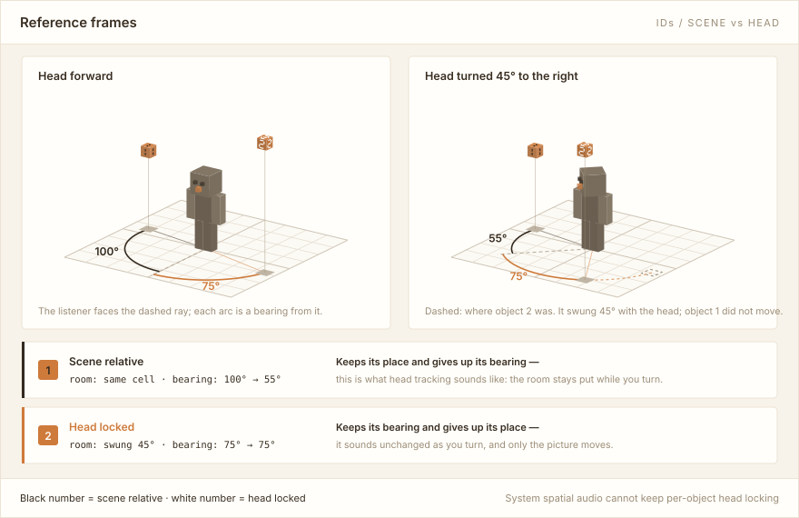
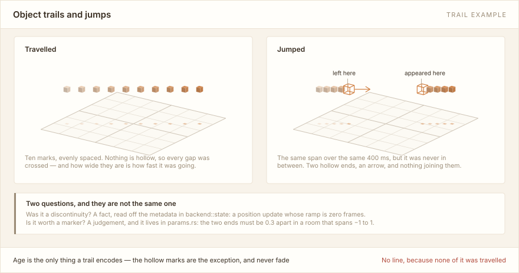
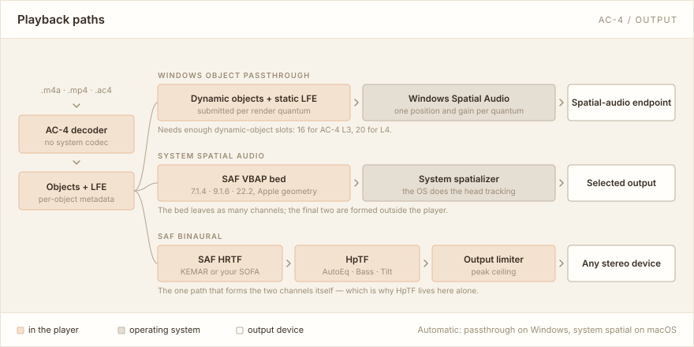
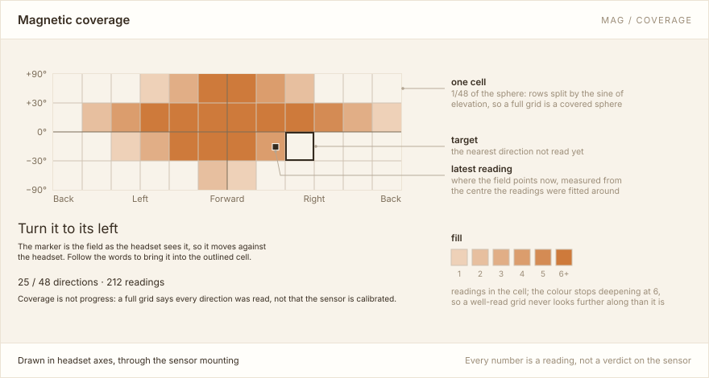
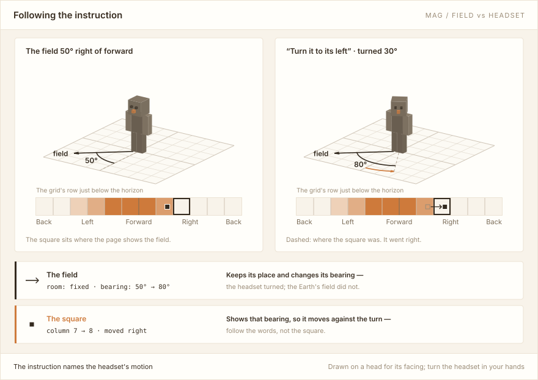

# 用户手册

**简体中文** · [English](MANUAL.en.md) · [返回 README](../README.md)

[README](../README.md) 负责让你装上、打开、放出第一声。这份手册接着往下讲：**窗口里每样东西读的是什么**。
它不是设计文档——[开发者文档](#延伸阅读)在另一边，讲的是代码怎么组织的；这里只讲你在屏幕上看得见的部分。

不必从头读。按你手上的问题跳：想知道场景里那些方块和光圈在说什么，去[响度显示](#响度显示lvl)；
想知道该选哪个播放模式、耳机补偿为什么只在一个模式下出现，去[播放模式](#播放模式)。

## 目录

- [窗口一览](#窗口一览)
- [内置演示曲目](#内置演示曲目)
- [三维场景](#三维场景)
- [Visual settings](#visual-settings)
  - [元素编号（IDs）](#元素编号ids)
  - [响度显示（LVL）](#响度显示lvl)
  - [持续静音对象淡出](#持续静音对象淡出)
  - [表带（Meter bank）](#表带meter-bank)
  - [听者皮肤](#听者皮肤)
- [播放模式](#播放模式)
  - [四种模式](#四种模式)
  - [设置窗口的页签](#设置窗口的页签)
  - [系统空间音频](#系统空间音频)
  - [软件双耳与 HRTF](#软件双耳与-hrtf)
  - [耳机补偿（HpTF）](#耳机补偿hptf)
  - [头部追踪与听者朝向](#头部追踪与听者朝向)
- [查看文件内部](#查看文件内部)
- [延伸阅读](#延伸阅读)

## 窗口一览

窗口分四块，位置固定：

- **左侧栏**——播放列表和文件。顶部切换列表（`+` 新建，`⋯` 管理），下面是当前列表的条目。
  **单击**看信息，**双击**（或 Enter、右键 → Play）开始播放。
- **中间**——三维场景。所有对象的位置实时画在这里。
- **右上角**——**Demo** 播放内置演示曲目（见[下一节](#内置演示曲目)），**About** 显示版本和第三方许可，
  外加两个设置按钮：**Audio settings** 管声音怎么出去，**Visual settings** 管场景怎么画。
  后两者互不影响，改任何一个都不会中断当前这首歌的解码。
- **底部**——播放控制：上一曲 / 播放 / 下一曲、进度条、音量、静音，以及顺序、单曲循环、列表循环和随机。

打开 **Meter bank** 后，场景和底部控制之间会让出右侧一条栏，见[表带](#表带meter-bank)。

## 内置演示曲目

右上角的 **Demo** 按钮播放一段应用自带的曲子。它不需要任何文件，所以装完就能立刻看到三维场景、
表带、HRTF 切换和头部追踪在做什么——AC-4 空间音频的素材本来就不好找。再按一次（按钮变成
**Stop demo**）停止。Demo 默认 **Repeat one** 循环播放；底部播放模式可改为 **Play once**，
播完一次后停止。暂停、继续、拖动进度和播完后重播也使用底部控制，这些设置不会改动播放列表的模式。

**它不是 AC-4。** 声音是应用实时合成的，不经过解码器，所以状态行的容器一栏写的是 `built-in demo`，
而不是 `raw AC-4` 或 `ISO BMFF`。它能证明输出链路、渲染器、场景视图和表带是好的，**证明不了解码器**。
反过来这也有用：碰到问题时先按 Demo，能一刀切开"解码出错"和"输出出错"。

演示曲目不进播放列表，也不打断你的续播位置：停掉它后会恢复原文件的断点并保持暂停；
如果直接双击播放列表中的文件，则退出 Demo 并播放该文件。

### 曲子

帕赫贝尔的 D 大调卡农（1694，公有领域），约三分钟。选一首人人熟悉的曲子是有理由的：渲染器要是
丢了一个声部、把某个对象放错了位置，在陌生的曲子里你只会觉得"大概就长这样"，而在卡农里第二声部
奏的正是第一声部八拍前刚奏过的东西——对照物就在你的短期记忆里。

三把小提琴演奏同一条旋律线，各差两小节。它们在场景里被放上同一条圆形轨道，角度差正比于时间差，
所以**耳朵里听到的回声，眼睛里看到的就是它在绕圈**。

### 它依次演示什么

曲子分成几幕，每一幕展示一件事，边界落在低音回到首音的那一拍上：

| 大致时间 | 看什么 |
| --- | --- |
| 0–20 s | 低音独奏，三把小提琴依次进入。最基本的方位感和拖尾。 |
| 20–60 s | 三声部绕行，角度差 120°。卡农的曲式变成场景的结构。 |
| 60–87 s | 全曲最密的 32 分音符段。这里**故意不拆对象**，三条线保持飞行。 |
| 87–127 s | 同素材、同音色的一对孪生对象，一个 head-locked，一个 scene-relative。转头时只有一个跟着你走——这是本手册里最值得亲自试一次的对比。 |
| 127–153 s | 键盘：每个正在响的音占一个对象，位置取自它的音高。音越高越靠右也越高，升号音往里缩，因为钢琴上的黑键就是往里缩的。 |
| 153–173 s | 元数据能说而声音说不了的事：一个满增益却完全静音的对象（足迹的增益环留在地上，方块却退后了）、一个反复开关 `metadata_active` 的对象，以及两个增益渐变的对象。 |
| 173 s– | 回到绕行，收束。 |

**演示曲目里会大量出现空心线框方块**，尤其是键盘那一幕。十六个对象槽是时分复用的：一个音符接管
某个槽位时，播放器发的是一条 ramp 为 0 的位置更新，于是那个对象在场景里**瞬移**到新音的位置。所以
那些空心标记说的是"这个槽位换人了"，不是"有个对象飞过了房间"——正好是[三维场景](#三维场景)那节
讲的跳变标注。绕行的幕相反：位置更新带 ramp，走出来是均匀的拖尾。

**关于高度**：音高映射到高度是看得见的，但只能粗听。仰角的听觉线索几乎全部来自耳廓滤波，分辨阈
在 10°–20°，远不如水平方向。所以这件事反过来正好是[软件双耳与 HRTF](#软件双耳与-hrtf) 的现场对照——
换一个 SOFA 档案，这条高度轮廓的可读性会明显变化。

## 三维场景

**视角操作**：拖动旋转，`Shift` + 拖动平移，滚轮缩放。右上角 `ISO` / `TOP` / `BACK` / `SIDE` / `RESET`
直接跳到固定视角，旁边另有一个按钮在透视（`PERSP`）与正交（`ORTHO`）投影之间切换。

**这个开关不是审美选项，它解决一个具体问题。** 足迹靠变大来表示增益，所以安静的对象足迹比方块还窄——
分界线是 **−18.8 dB**。而正交的正上方视角会把方块和它正下方的足迹投到同一批像素上：

比 −18.8 dB 安静的对象，在 `ORTHO` + `TOP` 下足迹是**隐形**的。透视靠视差把方块从足迹上滑开——
离视轴越远滑得越多——足迹就回来了。所以正上方看不见某个东西时，先按一下投影切换。

**一次最多画 20 个对象。** 超出时左下角会说明还有多少没画出来——是没画，不是没播，音频不受影响。

**参照系**：开启元素编号后，**黑色编号表示场景固定**，**白色编号表示随头部移动**。场景上方实时统计
两种参照系各有多少个对象；统计框是固定正方形、数字居中，所以数字从一位变两位时框不会跳动。

这两者的区别**只在头转动时存在**，而且方向和直觉相反：

每个对象恒定的东西不一样：**场景固定的保住位置、放弃方位角；头锁的保住方位角、放弃位置**。而**你听到的是方位角**。
所以大家熟悉的那种头追效果——转头时声音钉在房间里、"好像有个东西在跑"——其实是**场景固定**；
而**头锁**听上去反而是"什么都没变"，只有画面里它跟着头跑。

场景视图里动的那个，恰恰是听上去不动的那个。

**轨迹**：每个对象身后拖着一串小方块，是它待过的地方。每 **40 ms** 取一个点、只留最近 **40** 个，
也就是 **1.6 秒**的历史；点的边长是对象本体的 0.30 倍（开着响度显示时还会随每个点**当时**测到的
电平上下浮动），越旧越淡。轨迹**只编码年龄**——不编码增益，所以它不必画箭头就有方向，亮的那头
是新的。每个点同时往地面投一个更淡的影子：这不是装饰，贴地或
正轴视角下空中的点根本没有深度可言，靠地面投影才落回网格。

点之间的**间距就是速度**。OAMD 的 ramp 是一条分段直线，走出来是一排均匀的点；ramp 越短，点越疏。

**但"跨得很快"和"根本没走过去"是两回事，而光看间距分不出来。**

元数据把对象**瞬间**挪走时——位置更新的 ramp 长度为 0——播放器把这一跳的**两端画成空心线框方块**，
比普通轨迹点大 1.6 倍，并且**不随年龄变淡**（它们正是要让眼睛找到的两个点）；再在**离开的那一端**
画一个短箭头指出它往哪儿去了。箭头是按屏幕尺寸画的，所以缩放时大小不变。

两端之间**故意不连线**，因为那段距离一点也没走过。要是连上、或者两端照常画成实心，这一跳就会被
读成"它非常快地横穿了房间"——恰恰是最该区分开的那个误读。

两道门槛不要混：**是不是瞬移**是事实，由码流里位置更新的 `ramp_frames == 0` 决定；**值不值得标**是
感知判断，要求两端至少相距 **0.30**（房间坐标是 −1…1）。没有后一道，一个不断发送小幅瞬时修正的流
会把整条轨迹变成一串空心方块，那比不标更糟。

轨迹在两处清空：**跳转、换源等播放键变化**时，以及某个槽位**换了元素或改了参照系**时——历史属于
那个对象，不属于槽位编号。

场景本身只回答"响的那个在哪"。它响多少，由下面几个开关决定。

## Visual settings

四个开关，前三个默认开启，第四个默认关闭。每个都独立，互不牵连，并在重启后保留。

### 元素编号（IDs）

把每个对象的元素编号印在方块上。**六个面都印**，所以从任何角度都读得到，而且**编号不随 `LVL` 移动**——
身份走深度缓冲（被挡住就该被挡住），读数走屏幕（永远面向你），各有各的位置。

静音虚化时，编号随所在面一起降低对比度：场景固定的黑号仍比面暗，头锁的白号仍比面亮，
淡出过程中保持两种参照系的颜色区别。

### 响度显示（LVL）

开启后，地面足迹分成两层读数，方块上方浮出一块铭牌。

- **细线外圈 = 增益**，元数据*要求*的那个值。
- **实心内芯 = 电平**，这个对象*实际交出来*的那个值。
- 两者使用一致的电平范围和分贝比例，所以内芯尺寸不会超过外圈，**两者之间的空隙就是全部信息**。

**宽圈套着小芯**，说明这个对象被定位了、被赋了增益，但轨道里几乎没有信号。这正是只看增益永远看不出来的
那类故障——增益是满的，图上也画得漂漂亮亮，声音却没有。

**单位由表带右上角的按钮统一选择。** 选择 dBFS，表带和场景使用 30 ms 快表；选择 LUFS-M，
两处同时使用 400 ms 动量响度。动态对象和 **0 号 LFE** 的铭牌、表带、足迹内芯、轨迹强弱均跟随选择，
不需要换算。隐藏表带后，场景继续使用已选单位。

铭牌宽度恒定，符号和数字各占固定一格，所以读数跨过 −10 时不会横跳。读数掉到 `−∞` 时铭牌变暗，
持续静音后再淡出；两种计量窗口分别保留静音计时。轨迹保存两种窗口的历史电平，切换后仍显示当时的测量。

所有声道都在渲染前按相同的 K 加权计算，并有参考实现对拍。读数计入元数据增益、不受主音量影响。
这里显示的是各对象或声道的诊断读数，不是整段节目的总响度。0 号 LFE 的铭牌固定在前墙柜体上方。

### 持续静音对象淡出

这是唯一一个和"读数"无关、只和"画不画"有关的开关。它和 `LVL` 相互独立：关掉 `LVL` 不影响淡出，
关掉淡出也不影响读数。

约两秒没有信号的对象会淡出场景：铭牌从那档暗色继续退到完全消失，方块退成幽灵。**但地面的 gain 环留着。**

这一点是刻意的，也是这个开关最要紧的地方：**"有增益却没信号"本身就是持续静音的**。如果把环一起藏掉，
等于恰好在故障最明显的时候把故障藏起来。声音一回来，一切立即恢复。

场景上方的统计条会多出一个灰色的 **Silent** 计数，告诉你有几个对象已经淡出。关闭淡出会把对象整个留在
画面上并隐藏这个计数，静音的铭牌停在那档暗色。**静音计时在关闭期间照常走**，所以再打开时每个对象是在
它该在的位置，而不是从头开始数。

### 表带（Meter bank）

四个开关里唯一默认关闭的一个——因为它是唯一要从场景手里拿走宽度的。打开后场景右侧出现一条栏，每个对象一行。

存在 LFE 时，最上方增加 **0 号**一行，包含电平、增益刻线、峰值保持和削波指示。
它与其他行使用相同的所选单位，电平条和数值列对齐，不占用 20 个动态对象的显示额度。

一行上有四个标记，栏头那句 `tick = gain · line = peak · red = clip` 就是它们的图例：

- **横条**——实测电平，从左侧填起。
- **竖线（tick）**——元数据要求的 gain，画在**同一条标尺**上。
- **另一条线（line）**——peak 标记，先停住约 1.6 秒再下滑。
- **满刻度处的红段（red）**——采样削顶。

横条远远够不到竖线，就是足迹里那个"被定位、被赋了增益、轨道里却什么都没有"的病例，只不过这次是精确
读出来的，不用眼估。

**栏头的按钮切换单位，按钮上写的就是当前单位：**

- **`dBFS`**——所有声道的快表读数：30 ms 窗，带表头弹道。
- **`LUFS-M`**——所有声道的 400 ms K 加权动量响度，**不带弹道**——
  加上起落时间就成了一个"像标准但不是标准"的量。

切换改变的是横条和数字**共同测量的东西**，不是给同一个值换个标签。

削顶是唯一完全不加权的读数，因为转换器不是按听觉模型削顶的。

表带和场景**不是彼此的缩小版**：表带回答"哪些在响、响多少"，场景回答"响的那个在哪"。两边共用同一条
分贝标尺和同一个静音地板，所以同一个对象在两处的读数不会互相矛盾。

窗口高度不足时可以在表格中纵向滚动查看其余对象，栏头和底部播放控制保持固定。

### 听者皮肤

**Visual settings → Listener skin** 切换场景中央那个听者的外观。

点击 **Import skin PNG…** 导入标准 64×64 Minecraft 皮肤。程序根据手臂区域的透明留白自动识别
Steve（4 像素宽手臂）或 Alex（3 像素宽手臂）；如果你的编辑器填满了这些留白，可以在体型下拉框中手动指定。

支持独立左右肢体、透明衣帽外层和头部朝向同步，也兼容旧版 64×32 Steve 皮肤。导入的图片会复制到数据目录
的 `skins/`，所以原图移动或删除后仍可使用。皮肤列表、当前选择和手动体型会在重启后保留。选择
**Default figure** 恢复默认角色。

## 播放模式

在 **Audio settings** 里切换。**选错了不要紧**——切换是热生效的，不会中断当前这首歌的解码。

先看一眼声音到底走哪条路：

这张图解释了一件否则要绕好几句话的事：**前两条链路在"还没有两个声道"的时候就把数据交给了操作系统**，
所以任何作用在最终两声道上的处理——[耳机补偿](#耳机补偿hptf)就是——只可能出现在第三条链路里。

### 四种模式

| 模式 | 可用平台 | 说明 |
| --- | --- | --- |
| **Automatic**（默认） | 全部 | Windows 用对象直通，macOS 用系统空间音频 |
| **Windows object passthrough** | Windows | 把 AC-4 的动态对象原样交给 Windows 空间声音，需要先在系统里启用空间声音格式 |
| **System spatial audio** | macOS / Windows | 先渲染成 7.1.4 / 9.1.6 / 22.2 多声道床（Apple 几何），再交给系统的空间音频。默认 7.1.4 |
| **SAF binaural** | macOS / Windows | 软件双耳渲染，任何普通立体声耳机都能用；内置 KEMAR，也可以选自己的 SOFA 文件 |

**不确定选哪个？** 想先确认文件本身能播，切到 **SAF binaural**——它只需要一副普通耳机，不依赖系统设置，
也不依赖设备能提供多少对象槽位。

Windows 对象直通对设备有硬性要求，见 README 的
[Windows 空间音频的前提](../README.md#windows-空间音频的前提)。

### 设置窗口的页签

播放模式在窗口顶部，它下面是一排页签，**哪些页签存在由模式决定**：

| 模式 | 页签 |
| --- | --- |
| System spatial audio | `Speakers` / `Head` |
| SAF binaural | `HRTF` / `Headphones` / `Head` |
| Windows object passthrough | `Head` |

分页的目的不只是让每页短一点——页签固定在内容之上，所以再长的一页也推不走换页的入口。

### 系统空间音频

**床布局**在 `Speakers` 页选择：7.1.4（默认）、9.1.6、22.2，几何按 Apple 的定义。

**22.2** 默认把单路 LFE 以等功率复制到两路 LFE，也可以选择直通。

**macOS 控制中心的「杜比全景声」标签仅在 7.1.4 系统空间音频输出时生效**，9.1.6 和 22.2 不生效。
"控制中心 Atmos 标识辅助"默认开启，可以关闭；关闭后仍保留系统空间音频和系统头追。辅助音轨采用约 24 小时
的连续时间线，避免原来每约 30 秒更换播放项时对 AirPods 回放的干扰，**不改变 AC-4 的渲染方式**。
详见[播放集成](MACINRENDER.md)。

### 软件双耳与 HRTF

内置 KEMAR 直接可用。要换成自己的 HRTF，在 `HRTF` 页选择一份 SOFA 文件——它会被复制到数据目录的
`sofa/` 中统一管理，下次可直接从列表选择。

列表里两种状态：**available** 表示文件可选择，**in use** 表示当前双耳渲染器已成功启用该文件。
加载失败会显示具体错误。

列表本身只显示四行，再多就在原地滚动，并且打开时自动滚到当前选中的那一行——文件夹能放多少份是没有上限的，
设置窗口的高度不跟着它长。

大型 SOFA 的首次准备使用加速三角化与稀疏插值表构建；方向表独立缓存。输出格式兼容时，跳转、单曲循环和切歌
复用已准备的 HRTF，无需反复初始化。

### 耳机补偿（HpTF）

把耳机自身的频响从双耳监听里补掉。**仅在 SAF binaural 下可用**——原因看[上面那张图](#播放模式)：
系统空间音频和 Windows 对象直通把多声道床交给操作系统，最终两声道根本不在播放器这一侧生成。

补偿加在输出限幅之前，所以被抬高的频段仍受峰值保护；换档位走短交叉淡化，不中断播放。

#### 载入一份 profile

先到 [AutoEq 网站](https://autoeq.app/) 搜索自己的耳机型号，下载参数均衡器（Parametric EQ）文本配置，
再在 `Headphones` 页载入。播放器支持 AutoEq 的 `ParametricEQ.txt` 格式。
选中的文件会复制到数据目录的 `hptf/` 中统一管理，和 SOFA 一样按 **available** / **in use** 列出。

设置里会画出响应曲线，含 preamp 和实际生效的额外衰减，顶线为满刻度——可以直接看出它把哪些频段抬了多少、
还剩多少余量。曲线仍然高于 0 dBFS 时，可以让播放器再压一点。

把指针停在列表里另一份上，**它的曲线会按文件原样淡淡地叠在后面**。只是画出来，不会送去渲染器，
所以比较两份不会打断正在听的那一份。

#### 逐段核对

读到文件的那一刻，播放器会拿渲染器自己的解析逐段核对一遍——类型、频率、增益、Q，外加 preamp——
对不上就在图下直说。不必等它跑起来，悬停预览的那一份也一样核对。

#### Bass 与 Tilt

profile 之上还有两个旋钮：

- **Bass**——105 Hz、Q 0.70 的低架，就是 AutoEq `--bass-boost` 那一个。
- **Tilt**——绕 1 kHz 的直线斜率，±2 dB/oct，实测偏直线不超过 0.25 dB。

**旋钮产生的段附加在 profile 后面，不并进去**：面板单独计数，虚线另画 profile 本身，转回零就完全回到
文件原样。

#### 存成 profile

调好之后可以 **Save as profile…**：连同调整写成一份普通 profile 存进 `hptf/`、选中、旋钮归零。
于是它变成一份可以拷走、可以分享的文件，而不是设置里的两个数。

#### 和 SOFA 的参考场配套

曲线补偿到哪条目标由文件本身决定，**文件里并不记录这一点**，播放器只显示文件名和实际生效的段数与 preamp。

请自行让它与所用 SOFA 的参考场配套——例如扩散场均衡过的 HRTF 配扩散场目标的曲线。
[AutoEq 仓库](https://github.com/jaakkopasanen/AutoEq)发布的预设用的是 Harman 目标并额外加了 6 dB 低音抬升。

### 头部追踪与听者朝向

**逐对象头追**：软件双耳和 Windows 对象直通遵守内容指定的场景固定 / 头部固定参照系，支持动态切换。
系统空间音频保持所选输出，对无法保留的逐对象跟头语义显示提示；无法解释的策略按场景固定降级并提供诊断。

一条弧在张合，一条弧是刚性的——**张合的那条是你耳朵听到的变化**。

**听者朝向**在 `Head` 页调整，可用性按模式分：

| 模式 | 朝向来源 |
| --- | --- |
| SAF binaural | AirPods 头部追踪（macOS，需要带运动权限声明的正式 `.app`）、PoseBridge BLE/USB 或手动 |
| Windows object passthrough | PoseBridge BLE/USB 或手动 |
| System spatial audio | 由系统负责 |

**朝向盘**：场景标题 `Object scene` 右边那个小圆盘，只在朝向归本程序管时出现（上表前两行；
system spatial audio 由系统持有朝向且从不告知，画出来只会是一个笃定的零）。它画的是从后上方看的听者：
环上那个点在你面朝的方位，正前为上，只表示 yaw；中间那条**视线**抬头时上移、随头一起倾斜，
表示 pitch 和 roll。颜色分三档——绿色为传感器正在送数据，灰色为朝向就是你上次设定的值，
红色为要了传感器却没收到，此时朝向停在最后一次的位置。悬停显示三个角度和状态，
拖动转头，双击回正，右键直接切换朝向来源。设置窗口 `Head` 页是同一个盘，画得大一些，
兼作拖动区（原来那个写着 Drag here to turn your head 的灰框就是它替掉的），旁边仍可直接输入角度。

**键盘**（焦点不在输入框等控件上时，全窗口有效，同样只在朝向归本程序管时）：

| 键 | 作用 |
| --- | --- |
| `R` | 回正，等同 Recenter |
| `H` | 保持当前朝向，再按一次恢复跟随；来源和传感器连接保持不变 |
| `←` `→` | 左右转 5°，按住 `Shift` 为 1° |
| `↑` `↓` | 抬头低头 5°，按住 `Shift` 为 1°，限幅 ±85° |

方向键和拖动都会把来源切成 Manual——这正是从 AirPods 接管朝向的方式；选了 PoseBridge 传感器时
方向键和拖动无效，因为下一个采样就会覆盖掉，但 `R` 和双击仍然有效，那是给传感器重新定参考。
roll 不在任何按键上，只有传感器会报。

暂停跟随只对当前会话有效，不会改变保存的朝向来源。暂停时显示 `Orientation held · H to resume`，
传感器继续采样，恢复时沿用原来的回正参考。手动调整、回正、切换来源或切到系统空间音频会解除暂停。

**转头之后声音方向跟不上？** 先排除回放链路的延迟。虚拟声卡、虚拟混音软件和无线耳机都会引入额外缓冲。
建议先用声卡直连有线耳机作为对照，再逐一接入其他设备，就能区分是链路延迟还是头部追踪本身的响应。

### PoseBridge 传感器

在 **Head → Head orientation → PoseBridge sensor** 选择内置设备来源，不需要安装或启动独立桥接程序。
支持 BWT901BLECL5.0，macOS/Windows 均可使用 BLE 或 USB。

选好来源后，`Head` 页只保留一行摘要：当前朝向状态、连接后的实际采样率，以及 Recenter listening
direction。其余操作都在 **Device panel…** 打开的独立窗口里。该窗口可自由缩放，也可以和 3D 场景
并排摆着——核对安装轴时正需要一边转头一边看小人有没有跟着点头。
窗口默认使用双栏：Device 左侧选择设备、安装方向和采集方式，右侧编辑采样率、输出格式与融合模式。
窄窗口自动切为单列。连接、断开、回正固定在顶部；Device 页的读取、撤销和应用固定在底部。

1. 在设备窗口的 **Device** 页选择 Bluetooth LE／USB serial，点击 Scan，选择设备。
   macOS 上用 BLE 要运行包含 Bluetooth 权限说明的 `.app`，并在首次扫描或连接时允许访问。
2. 选择传感器指向头部 Right／Forward／Up 的三个轴，必须组成右手基底；佩戴后检查三轴方向。
3. 点击 Connect。播放器只读检查当前输出格式，不自动改变速率、格式或校准；下次启动仍需手动连接。
4. 用 Recenter listening direction 回正，`Head` 页的摘要行和设备窗口顶部都有。
   首次连接和重连保持当前听音朝向。

切换到其他头部朝向来源或系统空间音频时，停止采集，并禁用仍打开的设备窗口中的 **Connect**。
重新选择 PoseBridge sensor 和支持追踪的播放模式后，再手动连接。

**用动作核对安装轴。** 连上并开始追踪后，`Tracking` 页的 **Mounting check** 区域不靠听就能验证三轴。
依次点 Nod / Shake / Tilt 的 **Start**，每次给 4 秒窗口，按提示做一个方向明确的动作再回到原位——
抬头、向左转、向右肩侧倾。每个动作物理上只绕一个头部轴旋转，所以它在姿态上转出来的那个轴，
就指出当前哪一项存着这个动作真正用到的传感器轴；三个动作定出全部三项。

三种结果：三项都与当前设置一致时报告已核对通过；不一致时给出这三个动作描述出的安装映射，
**Use this mounting** 把它写入设置——只改设置，要 Disconnect 再 Connect 才生效。
应用后，在重新连接前暂停检查；更换设备、连接会话或传感器姿态参考、停止追踪时清除本次检查结果。
重新开始某个动作会立即清除该动作的旧结果，取消或失败都不会恢复旧结果。
动作幅度不足 20°、同时绕了多个轴、方向做反（三轴成了左手系）或两个动作落在同一个轴上，
都会说明原因并要求重做，不会取平均。该检查全程不向传感器写入任何内容。

本次使用的 **WT901BLE68（BWT901BLECL5.0）**，当前安装方向记录如下（2026-09-20）：

| Device 页字段 | 传感器轴 |
| --- | --- |
| Right | **−Y** |
| Forward | **+X** |
| Up | **+Z** |

已核对播放器保存的 BLE 和 USB 配置，两者均为这组映射。播放器配置中的 `mounting` 为 `[-2, 1, 3]`；
独立 PoseBridge CLI 的等价参数为 `--mount=-y,+x,+z`。
最初测试用的 `+X / +Y / +Z` 单位映射曾出现“点头表现为侧倾”的现象，后续按上表复用当前安装配置；
这正是上面 **Mounting check** 能直接判出的情形。
修改时先 Disconnect，设置三轴后 Connect，再 Recenter。这是该设备当前安装方向的记录；
更换安装位置后需重新核对点头对应 Pitch、侧倾对应 Roll，以及各轴正方向。BLE／USB 的配置分别保存。

**使用反馈（2026-09-20）：** 当前这台 WT901BLE68 在 **20 Hz** 下主观上已足够灵敏，
用户认为与 **AirPods Max 有线模式** 相比也足够。该反馈对应当前安装与回放链路，未包含毫秒级端到端延迟测量。

Smoothing 默认 10 ms，可在 0–50 ms 调整；Freeze after 默认 100 ms，可在 50–500 ms 调整。
设备若仍以 10 Hz 等低速输出，可显式提高回传率，或将冻结阈值设得长于采样间隔；播放器不会自动调率。
数据过期时冻结当前朝向；Diagnostics 分开显示采样、主机交付与接收后年龄。
设备时间未同步，年龄不包含传感器、USB/BLE 和音频延迟。BLE 批量交付不会因为增加轮询频率而消失。

#### 传感器端增强

`Tracking` 页的 **Sensor-side enhancement** 默认关闭。打开后，播放器借助传感器自带的时间戳和同一帧的角速度，
把每个新测到的姿态顺着正在转的方向往前推一小段，抵掉一部分传输延迟；关着就是普通追踪。

开关只改播放器，不重连、不写传感器、不改速率，所以可以边听边切换对比，切换本身有 50 ms 过渡。开关下方一直
写着它此刻的状态：普通、预热、增强，或者退回普通追踪的原因。

- **需要什么**——设备要输出时间戳和角速度，也就是 **0xA4** 格式，见下文[准备增强数据](#准备增强数据)。
  缺一样就停在普通追踪。
- **何时开始**——先预热：至少 8 个样本、跨过 300 ms，并且设备时钟稳定。
- **推多远**——每个样本最多 25 ms、最多 5°，推完再走同一个 Smoothing。
- **何时不推**——几乎静止时不推：角速度和姿态变化都低于 1°/s 并持续 500 ms，有加速度数据时还要接近 1 g。
  这样静止的头不会跟着抖。
- **何时退回普通追踪**——角速度积分与测到的姿态相差超过 5°、加速度超出 0.5–1.5 g、没有时间戳，
  或者设备时钟不稳。

增强时，**Freeze after** 看两种年龄、取较大的一个：主机收到样本后过了多久，以及按设备时钟推算样本实际有多旧。
后者能看出 BLE 一次送来一批时，排在前面的样本其实已经等了一会儿。一旦过期，当前朝向立即冻结，预测和平滑都停下。
Recenter 和安装检查始终读未经预测的测量；声音和场景用的是同一个最终朝向。

#### 修改设备设置

采样率、输出格式和融合模式在 `Device` 页右侧修改，改的是一份草稿：

1. 点底部的 **Read settings**，读出设备当前的配置。
2. 在右侧挑新值。每个选项里，**绿色 ✓** 是设备回读的当前值，**橙色 •** 是你选的待写入值，底部显示还有几项
   待写入。追踪时也可以先改。
3. 用顶部的 **Disconnect** 停止追踪。
4. 点底部的 **Apply changes**。播放器先重新读一遍配置，只写你改过的项，每写一项回读一次，最后再核对整组配置。
5. 写完后手动 **Connect**。

读取之后设备被别处改过、中途取消、只写成了一部分，都会明说，不会把没完成的改动标成成功。**Discard edits**
只丢掉草稿，已经写进设备的改动不会撤销。九轴与六轴融合互相切换时，传感器的参考方向可能跟着变。
**Apply changes** 只写这几项设置，不校准、不归零，也不写 Flash——那些在 `Maintenance` 页。

#### 准备增强数据

传感器端增强要的时间戳和角速度，得让设备换一种输出格式。**Prepare enhanced data** 把草稿里的格式换成已验证的
**0xA4**（时间戳＋角速度＋四元数），采样率不动，写入成功后再把采集方式切到 **Read current stream format**。
它只改草稿：照上面的步骤 **Apply changes**，再手动 **Connect**。

30 字节的完整惯性帧 **0xE4**（在 0xA4 之外再加加速度）只能在 20 Hz 下用；USB 和 BLE 的实机验收还没做完，
所以不放进预设。设备已经在输出带加速度的 Motion 格式时，Diagnostics 照样显示加速度，但没有时间戳就不会预测。

#### 诊断

`Diagnostics` 页分两栏。

**Sensor processing** 是增强所依据的数据：

- 实际的姿态来源（原生四元数、由欧拉角换算等），以及换到头部坐标轴之后的角速度和加速度。
- 设备时钟是否就绪、漂移多少 ppm。播放器用最近 10 秒的样本对齐设备时钟与主机时钟：每秒一格，每格只留送达
  最快的那个样本；满五格才估漂移，超过 ±5000 ppm 就算不稳。
- **Estimated excess holding**——这个样本比最近送达最快的样本多等了多久，也就是批量交付额外加上的延迟。
  **它不是完整的听音延迟**：传感器融合、USB／BLE 固定传输和音频输出的延迟都量不到，播放器也不拿排队的
  音频帧数去冒充。
- 最近一次预测推了多少毫秒、多少度，角速度积分与姿态之间的残差，以及样本、合并和历史溢出的计数。

**Connection details** 是连接本身：主机收到样本后的年龄、采样率与交付频率（一次交付最多带几个样本）、重连与
无效姿态的次数、设备时间戳、固件版本，以及最近一次设备操作的结果。

#### 校准、归零与保存

这些操作在 `Maintenance` 页，分两栏。每个都先弹出确认框、写明它会做什么，也都不会混进 **Apply changes**。

- **Calibration and reference**——都不写 Flash。**Zero device yaw** 要求六轴模式，播放器不会替你切换；
  **Calibrate accelerometer** 要让传感器水平、静止；**Magnetic calibration…** 通往下面的 Magnetic 页，
  磁校准不在这里开始。
- **Saved device settings**——会写入设备自己保存的设置，按钮用警示色：**Save current device settings**、
  **Set device angle reference and save**、**Restore device defaults and save**。

操作结束后手动 **Connect**。结果按“已发送、已回读、已观察到完成、持久化”几项报告：它们只说明命令送到了、
寄存器变了，不说明校准准不准，也不说明断电后还在。

磁校准必须显式结束。没结束就退出会被拦下，窗口最小化或被遮挡时也一样，窗口会恢复出来显示原因。

#### 磁校准

**磁校准有单独的 Magnetic 页。** 打开这一页不读任何东西；点 **Open magnetic session** 才开始读。会话独占
传感器，所以整个会话期间头部追踪停止，听音方向停在原处（播放照常）；顶部栏的按钮这时叫 **Close session**。
会话每秒读五次传感器报告的磁场，自己不写入任何内容，把读数来自哪些方向画在 48 格的网格上：12 列方位，
正前方在正中，正后方是左右两边；4 行仰角，地平线横在中间。每格占球面的份额相同，画满网格就是每个方向都
读到了。格子随读数加深，到六个为止：覆盖不是进度，页面上的任何数字都不是对传感器校准的判决。

网格按耳机轴绘制，所以需要右手系的安装映射，没有就不打开会话——安装错了，每一条指示都会指反。
**Check the mounting on Tracking** 通往上文的三个核对动作。

传感器留在耳机上，把耳机摘下来拿在手里慢慢转：驱动单元的磁铁要和传感器一起标定进去，颈部也够不到足够多的
方向。离钢制家具、显示器支臂、音箱、手机和笔记本一米以上，否则它们会被当成地磁标定进去。

同一张网格要扫三轮：

1. **校准前。** 转动耳机直到网格填满。这一轮是评判校准的基准，跳过它就没有东西可比。
   **Start calibration…** 经确认后开始校准。
2. **校准中。** 警示条一直显示设备名和已用时间，**End calibration** 是唯一可用的操作。它不会超时，
   回读确认结束之前不能退出。
3. **结束后。** 再扫一轮：只有结束之后的读数才能说明校准改变了什么。前后两轮都读满全部方向后，页面给出
   对比——各方向磁场强度的离散度，以及每轮方向所依据的中心。中心移向零，说明设备把校准用到了自己的输出上；
   只有这样，前后的离散度才可比。

**追着框出的格子转。** 网格上框出一格，是离最新读数最近、还没读到的方向；一个小方块标出最新读数的位置。
网格下方的大字写着把读数带过去的动作：前端上翘或下压、向左或向右转、向左或向右侧倾。小方块是耳机眼中的
磁场，而磁场本身不动，所以小方块和耳机**反着走**——照文字做，不要去推方块。一条指示至少保持片刻才换，
两个动作差不多时不会来回闪。读数几乎落在一个平面上时（耳机只绕一个轴转过就是这样），页面会直接说明：
圆环拟合不出中心，那个轴够不到的几行会一直空着。离散度以 3 % 和 8 % 为刻度，这两个值暂定，等真实耳机的
数据再定。

**不会自动保存。** 结束后页面会写明结束是否经回读确认；**Save current device settings…** 需要单独确认，
发出 SAVE 也不代表掉电后仍然保存。**Close session** 在任何阶段都能关闭会话；本会话开始的校准会在关闭时
收尾，但顶部栏的警示要等一次经回读确认的 **End calibration** 才会消失。传感器报告了一次不是本会话开始的
校准时，之前的各轮读数全部作废。被禁用的按钮会在下方写出原因。最后连接设备，确认听音方向稳得住：
离散度只说明这些读数彼此一致。
开始、结束或保存命令一旦入队就会拦截退出，直到操作返回结果，或显式取消并完成会话收尾。
会话失败后，**End calibration** 会重新连接原设备尝试结束；没有待完成操作且没有校准警示的只读会话可直接退出。
macOS BLE 请运行包含 Bluetooth 权限说明的 `.app`，并在首次扫描/连接时允许访问。

## 查看文件内部

**不播放也能看。** 两个入口：

- 文件卡片上的 **Details…**——比特流详情窗口：容器、节目、对象数量、低频声道、码率等。
- 场景标题右侧的 **`...`** 菜单——包含输出兼容性提示、切换到软件双耳的按钮，以及 **Playback diagnostics**
  诊断窗口入口（缓冲、解码和输出状态）。有兼容性提示时菜单按钮变色，不再单独占用场景中的一行。诊断能帮你判断是文件的问题
  还是设备的问题。

没有声音时的排查顺序在 README 的[常见问题](../README.md#常见问题)。

## 延伸阅读

用户侧：[README](../README.md)（安装、平台支持、常见问题、从源码构建）。

开发者侧（中文设计文档，讲的是代码怎么组织的，不是怎么用）：
[架构](ARCHITECTURE.md) ·
[播放集成（MacinRender）](MACINRENDER.md) ·
[Windows 解码](WINDOWS_DECODE.md) ·
[Windows Spatial Audio](WINDOWS_SPATIAL_AUDIO.md) ·
[播放列表与持久化](PLAYLISTS.md) ·
[数据目录与 SOFA](STORAGE.md) ·
[安装包与 CI](PACKAGING.md)
